Welcome to the first Agentstration newsletter. This edition presents the platform
through the experiences it enables: configuring specialized Agents, assembling
Flows, operating environments, following executions, and giving users a focused
Workplace in which to interact with the resulting services.

[Agentstration 0.2.0-alpha.1](https://github.com/gbaudrit/agentstration/releases/tag/v0.2.0-alpha.1)
is a public prerelease intended for local evaluation and contributor feedback. The
release makes the platform easier to understand and operate across the Console,
Bootstrap, Packs, security, model configuration, Flow authoring, Workplace, and
extensions.

## Table of contents

- What this release enables today
- Platform overview
- Platform foundations
- Security and access control
- Bootstrap and environment reproduction
- Resource, model, and runtime configuration
- Flow creation, orchestration, and operation
- Workplace experience
- Workspace cleanup
- Storage, deployment, and developer experience
- AEP extensions and MCP tools
- Alpha prerelease precautions

## What this release enables today

- Monitor platform health and move quickly to resources that require attention.
- Reproduce an environment from Bootstrap profiles and install complete solutions
  as Packs.
- Configure Model Providers, Model Profiles, and Runtime Profiles that multiple
  Agents can reuse.
- Design Flows visually and orchestrate sequential, concurrent, or handoff-based
  collaboration.
- Schedule executions, follow their progress, and replay the route participants
  actually followed.
- Compose Workplace dashboards and provide conversations adapted to desktop and
  mobile screens.
- Protect Workspaces with authentication, permissions, personal access tokens, and
  separate Secret management.
- Connect external model services and tools through AEP extensions and MCP.
- Use SQLite locally or select PostgreSQL for the platform’s main persisted data.

## Platform overview: the operating picture first

The Console home is presented as an operational dashboard. At a glance, teams can
see how many Agents are defined, whether Deployments are ready, which Triggers are
enabled, and whether any part of the platform needs attention. Recent events make
it easy to move from the overall picture to a specific execution or resource.

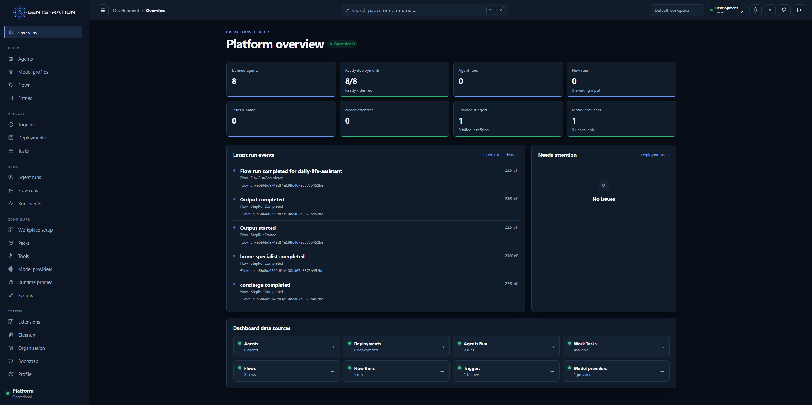

*The operations overview brings platform health, recent activity, and navigation
to the main operational resources into one place.*

This shared starting point helps administrators answer the most practical questions
first: Is the environment ready? Is work running? Did something fail? Where should
I investigate next?

## An executable platform foundation

Agentstration brings the resources needed for an agent solution into one governed
environment. Teams can define Agents, connect them to models and runtimes, assemble
Flows, publish entry points, schedule work, and inspect the resulting executions.

Offline Packs make complete examples or configurations easier to distribute. An
installed Pack clearly shows what it brought into the Workspace, which bindings it
uses, and which resources it manages. Teams can therefore understand the impact of
an installation before changing or removing it.

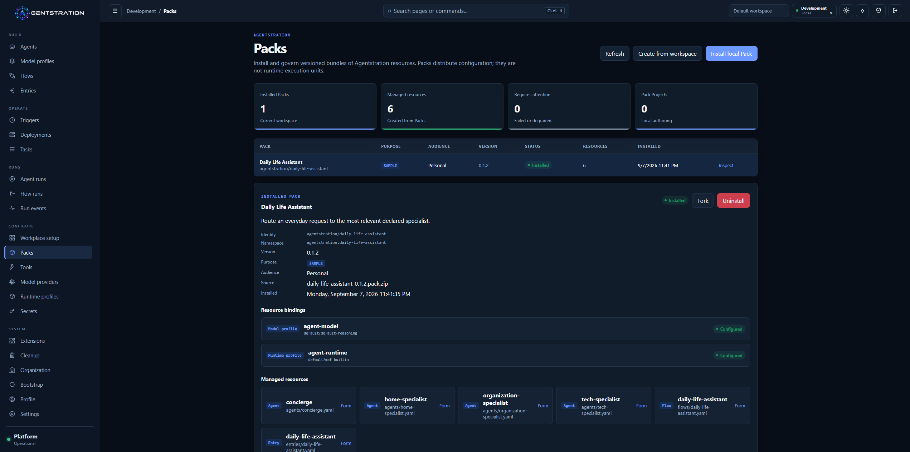

*The Daily Life Assistant Pack exposes its model and runtime bindings together with
the resources installed in the Workspace.*

Secrets are managed separately from ordinary resources. Users can see that a
credential is configured, where it is stored, and which Workspace owns it, without
ever displaying its value in the Console.

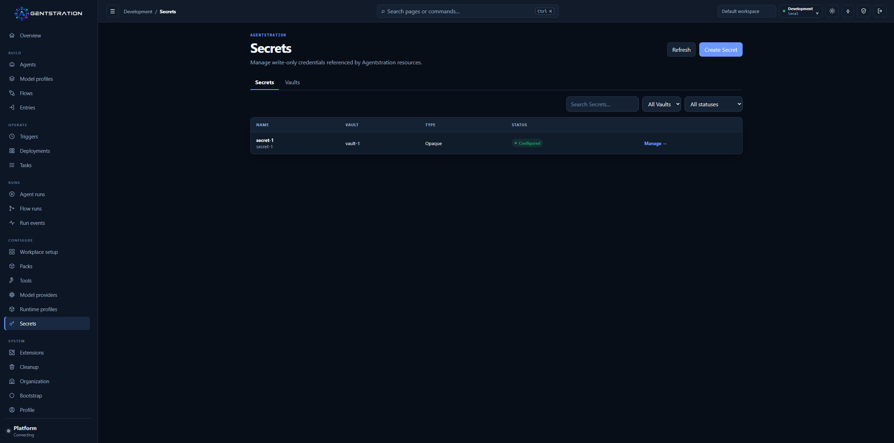

*The Secrets catalog exposes governed metadata and status, never the stored secret
value.*

Together, these capabilities provide a usable foundation for building and running
agent-based solutions without scattering their configuration across unrelated
tools.

> **Under the hood**
>
> - The product remains a local-first modular monolith with explicit Management,
>   Work, Runtime, and Flow boundaries; SQLite is the default store.
> - Revisions and published Flow versions are immutable, while Work and Trigger
>   history remains durable.
> - Trigger scheduling uses `Quartz.NET`; the local Vault encrypts values with
>   AES-256-GCM.

## Security becomes the default experience

Access to application data now requires authentication by default. Public health,
sign-in, and first-run surfaces remain reachable where necessary, while business
operations are protected consistently.

For scripts and command-line clients, users can create personal access tokens
limited to a selected Workspace. The form makes the token name, lifetime, and
permissions explicit. A token is displayed once when created and can later be
revoked.

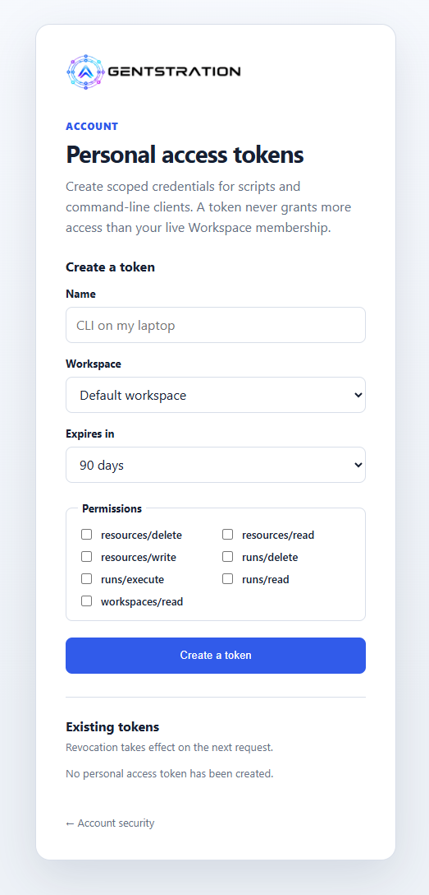

*A workspace-scoped personal access token is prepared with an explicit expiry and
permission selection.*

The practical result is simpler governance: access follows the user’s current role,
and removing a membership or permission also removes the associated token access.

> **Under the hood**
>
> - Only a SHA-256 digest of a personal access token is stored.
> - Effective permissions combine the token allow-list with the Principal’s current
>   Workspace role and are reevaluated on every request.
> - Run, SSE, Workplace, input, cancellation, and audit paths enforce Tenant,
>   Workspace, and Principal scope before accessing data.

## Bootstrap becomes an environment workflow

Bootstrap now gives administrators a guided way to reproduce an environment. They
can select one or more profiles, control their order, preview the resulting plan,
and apply it only after reviewing what will be created.

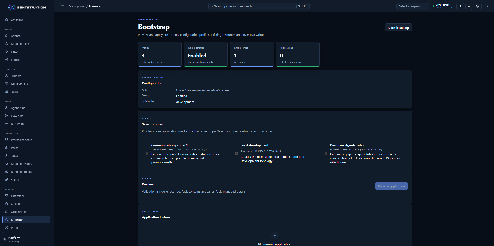

*The Bootstrap catalog presents profile selection, a safe preview step, and the
history of applied configurations.*

A profile can prepare a complete working context rather than a single isolated
record: model and runtime configuration, Agents, Flows, Entries, and local Packs can
all participate. Existing resources are preserved, and application history makes
it clear what happened and when.

Pack updates follow the same controlled approach. Resources already installed by a
Pack keep their stable identity, locally modified resources are protected, and
dependencies that require cleanup are shown instead of silently removed.

> **Under the hood**
>
> - Profiles target an Instance, Tenant, or Workspace and resolve typed bindings in
>   a declared order.
> - Preview is side-effect free, a digest protects the reviewed plan, and existing
>   resources are never overwritten.

## Resource configuration becomes more direct

The Console now makes complete Agent, Entry, and Flow definitions easier to inspect
and edit. Users can work through structured forms while still accessing a
consistently ordered Definition or YAML view when they need the full resource.
Resources installed by a Pack remain protected, while local or forked definitions
remain editable.

Model Providers make the connection between Agentstration and an inference service
visible. From one screen, an administrator can inspect the selected extension,
connection state, effective endpoint, and models currently available.

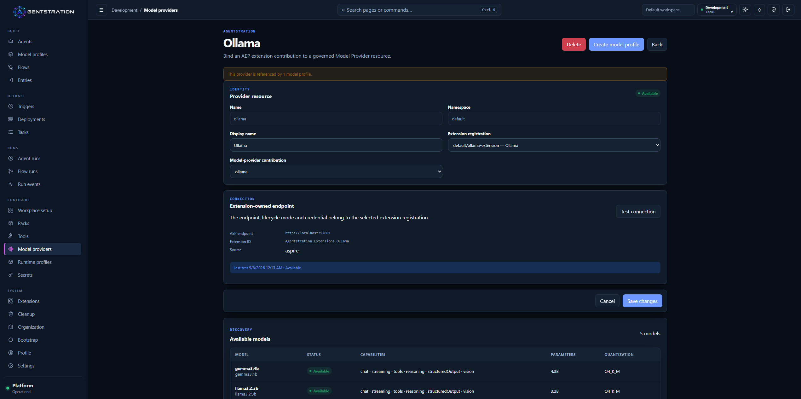

*The Ollama Model Provider keeps the governed resource, connection status, and
discovered catalog together.*

Model Profiles turn that provider and model choice into a reusable configuration.
Several Agents can use the same profile without each one carrying the details of
the underlying service.

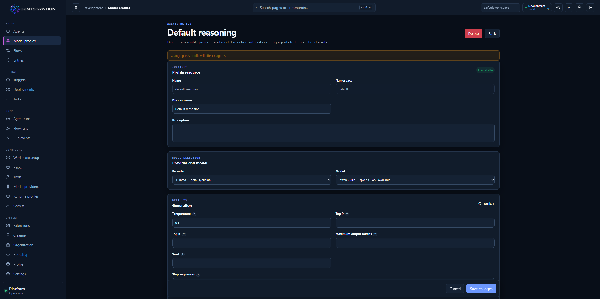

*A reusable Model Profile associates the controlled Ollama provider with a
discovered Qwen model and shared generation settings.*

Runtime Profiles separately describe how an Agent executes. The built-in
[Microsoft Agent Framework](https://github.com/microsoft/agent-framework) profile
shows its session, tool, and streaming policy as well as the Deployments that will
consume any change.

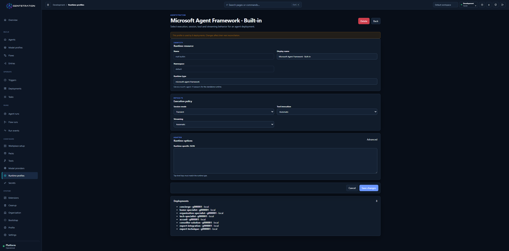

*The built-in runtime profile makes execution behavior and deployment usage
inspectable from the Console.*

> **Under the hood**
>
> - A Model Provider is a governed resource bound to an AEP extension.
> - Model Profiles separate portable generation defaults from provider options;
>   Runtime Profiles isolate adapter behavior from model selection.
> - Handoff instructions remain isolated per participant. Outbound AEP capture is
>   Development-only, explicit, and disabled by default.

## Flow creation, operation, and replay work together

Flow creation now brings visual design and orchestration choices into a clearer
authoring experience. Authors can arrange steps, connect transitions, edit the
underlying definition, validate the draft, and run it without leaving the Flow
workspace.

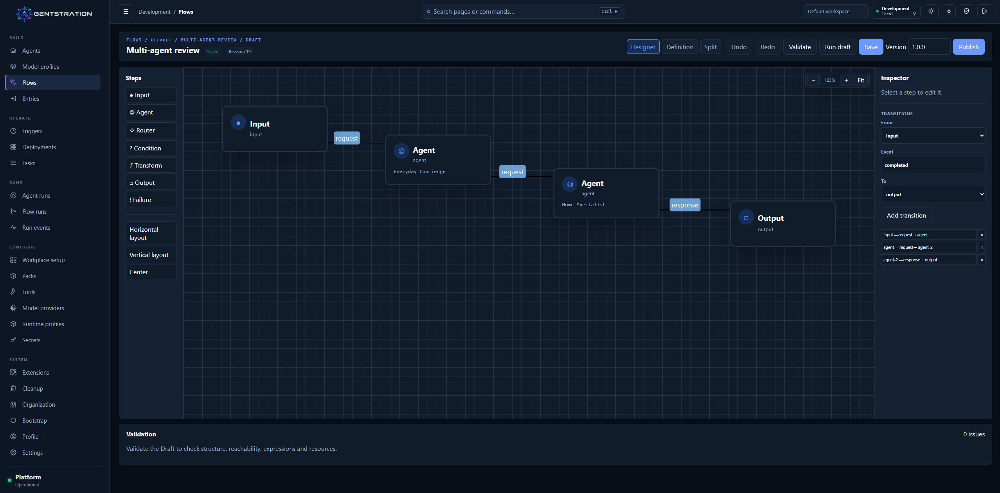

*The Designer keeps graph construction, transition editing, draft execution, and
validation in the same authoring surface.*

Multi-agent collaboration is configured separately from the visual layout. Authors
can choose sequential, concurrent, handoff, group-chat, or magnetic execution,
declare who may transfer control, limit participant turns, and preview the expected
topology before creating the orchestration.

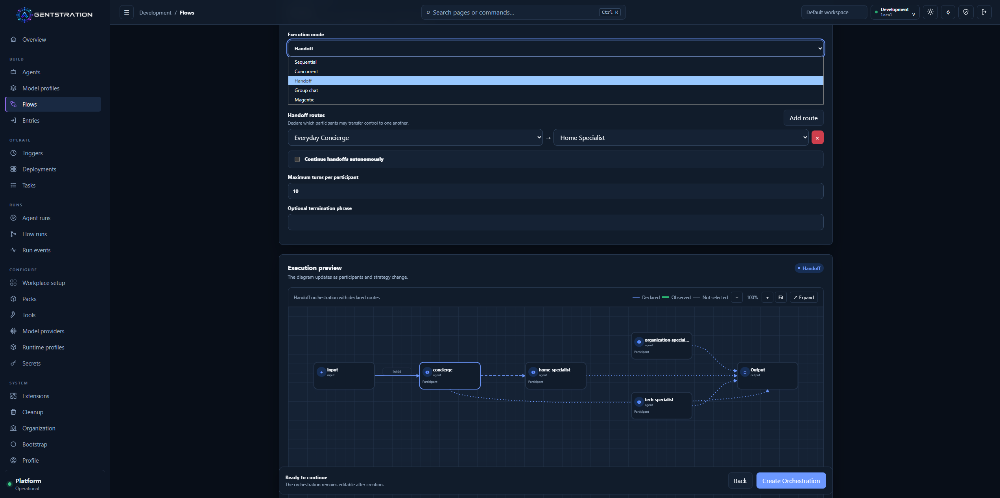

*Handoff configuration makes allowed transfers, execution limits, and the expected
participant topology visible before the Flow runs.*

Scheduled Triggers connect recurring activity to a governed Flow. Their detail view
shows when the next execution is expected, what will be submitted, which identity
will be used, and what happened during previous occurrences.

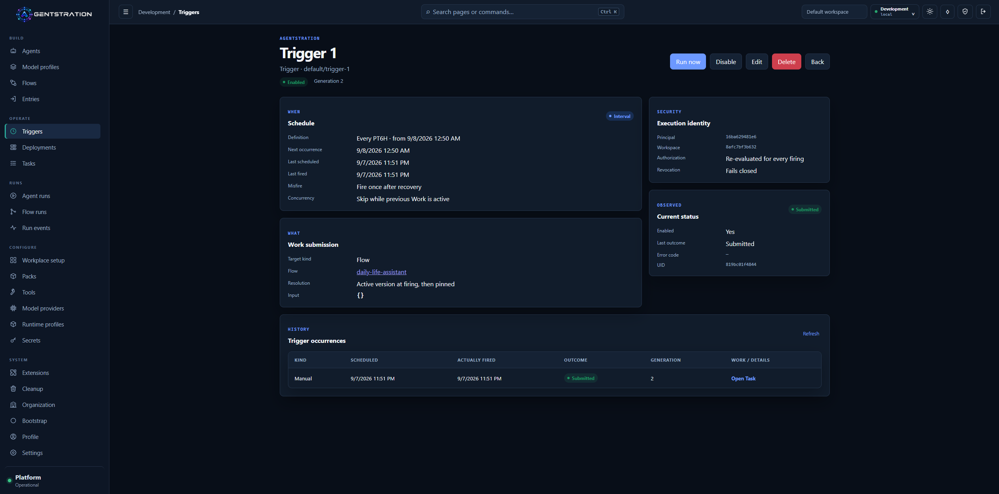

*A Trigger keeps its schedule, target, current status, and occurrence history in
one auditable view.*

After execution, the Flow Run summary shows duration, completed steps, turns,
participants, handoffs, and the observed participant path. Dedicated tabs expose
activity, transfers, input and output, and raw events when deeper investigation is
needed.

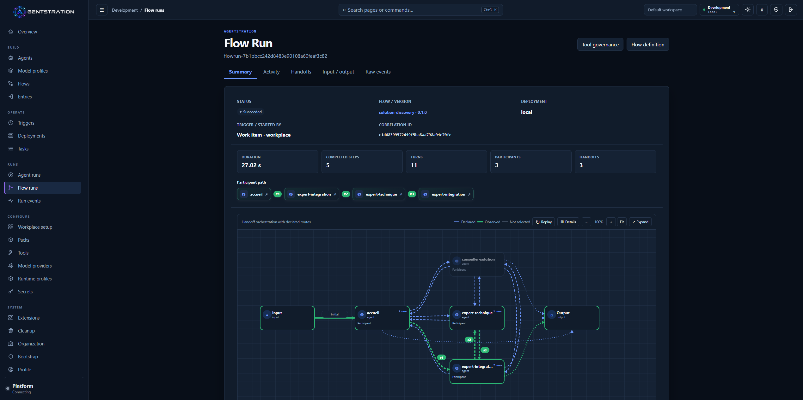

*A completed handoff Flow Run shows both the declared orchestration and the route
actually observed.*

Completed Runs can also be replayed visually. Replay helps an operator understand
the sequence that occurred without starting the Flow or calling its tools again.

> **Under the hood**
>
> - Published Flow versions are immutable; Runs retain events and topology snapshots.
> - Replay reconstructs persisted activity without reexecuting Agents or tools.
> - Stable event ordering, route layout, handoff termination, and Run scope checks
>   support the visual and operational experience.

## Workplace becomes a complete user-facing surface

Workplace turns published Entries into focused experiences for end users. The home
screen now selects the expected dashboard, uses friendly organization, Workspace,
and user names, and adapts its navigation and cards cleanly to smaller screens.

Administrators compose dashboards from the Console. They choose the primary Entry,
decide which other Entries are visible, control their role and order, and select the
icon shown to Workplace users.

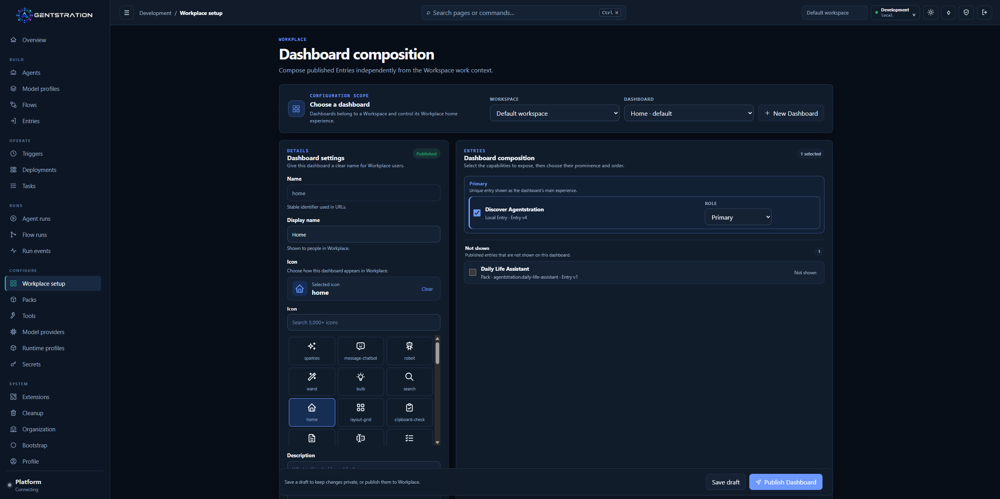

*The Home dashboard publishes Discover Agentstration as its primary experience and
keeps the Pack-provided Entry hidden.*

On mobile, the selected experience, suggested prompts, available spaces, Principal
context, and navigation remain easy to reach.

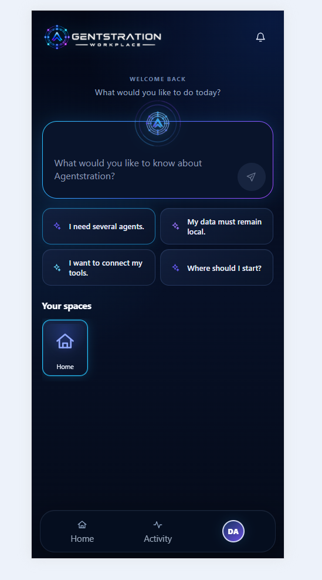

*The mobile home keeps the primary prompt, four controlled suggestions, spaces, and
navigation usable at touch-friendly sizes.*

Conversation views give more room to the request and response while keeping Task
state and execution details available when needed. Long-running work and
participant handoffs produce less transient visual noise, so users can focus on the
result.

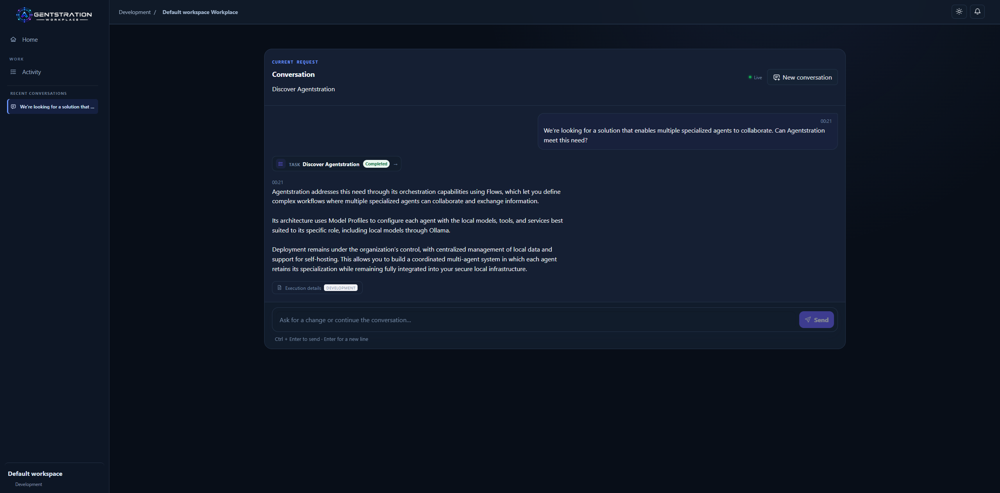

*The Workplace conversation presents the controlled Discover Agentstration
scenario together with its completed Task.*

The same interaction remains consistent on mobile: request, response, Task state,
execution details, continuation composer, and bottom navigation keep the same
logical order.

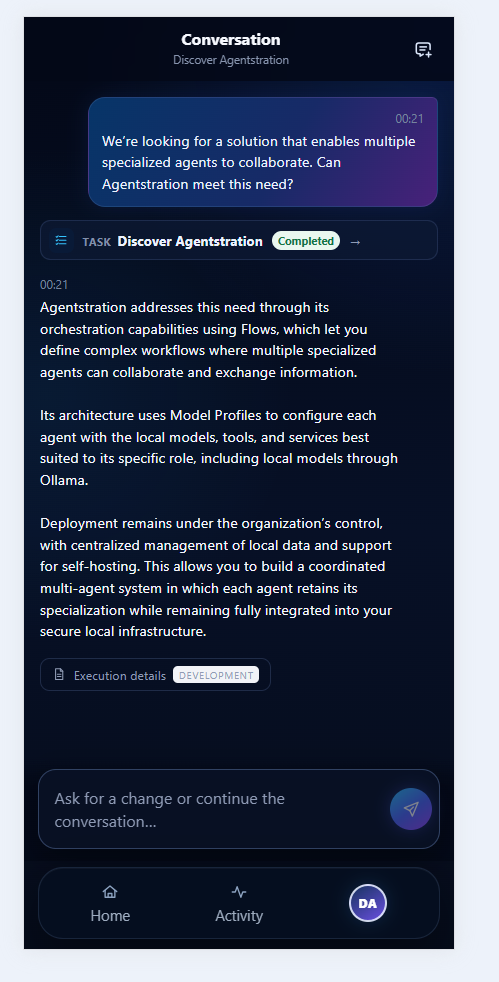

*The mobile conversation is a responsive version of the same controlled desktop
experience.*

> **Under the hood**
>
> - Console and Workplace ship with English and French product catalogs and store a
>   language preference per Principal.
> - Technical identifiers and user-authored content remain unchanged across locales.
> - Query-side filtering avoids repeated continuation lookups while retaining
>   Workspace isolation.

## Cleanup is guided and explicit

The Console now provides a Workspace cleanup screen for completed execution data
and configuration resources. Administrators can search, select items in bulk,
review dependencies, and confirm an irreversible operation before anything is
removed.

Cleanup follows the order required by the resources. Successfully removed items
disappear from the selection, while failures remain available for retry with a
clear result. This makes cleanup useful for local evaluation environments without
hiding partial failures or dependencies.

> **Under the hood**
>
> - Canonical delete APIs run in dependency order and require resource- and
>   Run-deletion permissions.
> - Only completed, failed, or cancelled Tasks are eligible; their Work data is
>   removed while retained conversations are detached.
> - Successful deletions remain applied if a later item fails.

## More deployment choices and clearer developer feedback

Agentstration remains easy to evaluate locally with SQLite as its default storage.
Teams that already operate PostgreSQL can instead choose a PostgreSQL 17 profile
for the platform’s main persisted data.

The development experience also becomes clearer. API documentation is available
through OpenAPI and Swagger UI, startup validates the selected storage option, and
Aspire can isolate multiple Development environments so contributors can work in
parallel without sharing ports or state.

> **Under the hood**
>
> - PostgreSQL uses separate schemas and migrations for the platform modules, with an
>   advisory lock during startup initialization.
> - File-backed Secrets, keys, Pack archives, and Work artifacts still require a
>   coordinated backup. PostgreSQL does not add multi-instance support.
> - Development exposes an OpenAPI 3.1 description covering authentication, Problem
>   Details, uploads, downloads, and SSE.

## AEP keeps extensions outside the platform process

AEP — the Agentstration Extension Protocol — lets the platform connect to external
capabilities while keeping their implementation independent. Agentstration retains
the stable resources and governance experience; extensions retain responsibility
for communicating with their own services.

For model inference, this means an administrator can use existing Ollama,
llama.cpp, or LocalAI services without embedding their provider-specific code in
the main product. Agentstration discovers what an extension offers, exposes it
through governed Model Providers, and leaves the external model catalog under the
owner’s control.

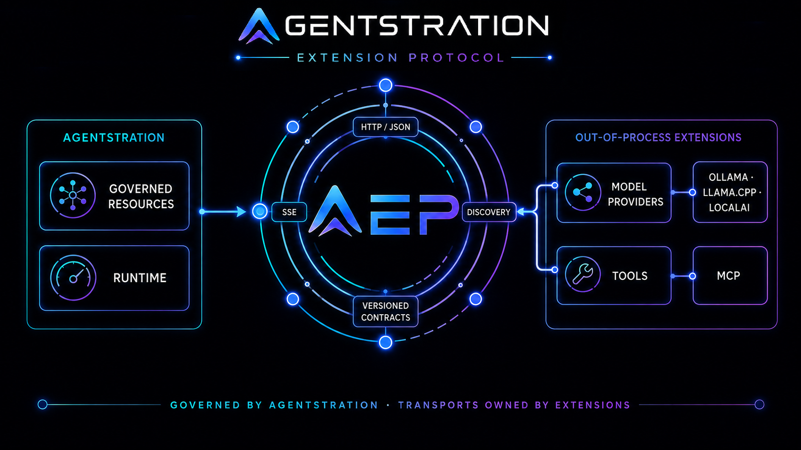

*AEP separates Agentstration governance from the transports owned by independent
extensions.*

The Extensions Console makes that boundary visible. Administrators can inspect
registered endpoints, discovery state, available contributions, versions, and the
resources that depend on them.

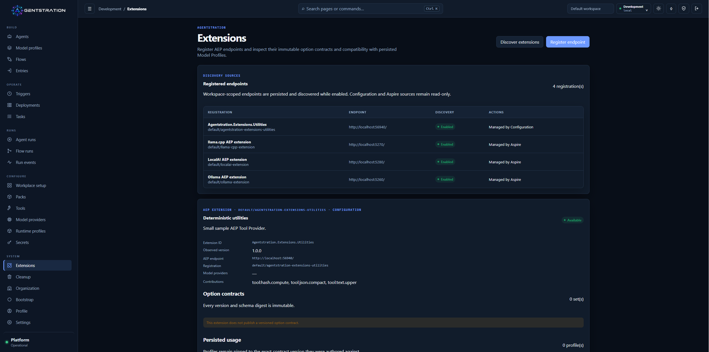

*The Extensions view brings registration, discovery, contributions, and persisted
usage into one governed surface.*

Tool extensions follow the same principle. AEP identifies the external MCP server
and tool, while Agentstration continues to control approval, authorization, and
audit. Newly discovered tools remain disabled until an administrator approves
them.

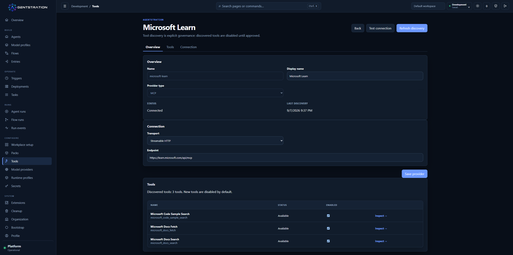

*A connected MCP provider exposes explicit discovery and individual tool
activation.*

> **Under the hood**
>
> - AEP uses HTTP/JSON discovery and SSE chat streaming.
> - Model Providers bind to named extension contributions, Model Profiles can pin
>   versioned contracts, and the runtime consumes `IChatClient`.
> - Discovery is explicit and never scans the local network. MCP remains authoritative
>   for tool schemas and invocation, with Agentstration guards and durable audit.

## Read the alpha label literally

This public prerelease is intended for evaluation and feedback. It changes some
foundational areas, so important evaluation data should be backed up and the
release should be started with fresh storage. Moving between SQLite and PostgreSQL
also does not transfer existing data.

The GitHub prerelease provides server and standalone Workplace ZIPs for Windows,
Linux, and macOS, plus container images for AMD64 and ARM64. For checksums, startup
commands, compatibility details, and the complete list of known limitations, use
the published sources:

- [GitHub Release and artifacts](https://github.com/gbaudrit/agentstration/releases/tag/v0.2.0-alpha.1)
- [Technical release notes at the tag](https://github.com/gbaudrit/agentstration/blob/v0.2.0-alpha.1/docs/releases/0.2.0-alpha.1.md)
- [Current capabilities at the tag](https://github.com/gbaudrit/agentstration/blob/v0.2.0-alpha.1/docs/reference/current-capabilities.md)
- [Declarative bootstrap reference](https://github.com/gbaudrit/agentstration/blob/v0.2.0-alpha.1/docs/reference/declarative-bootstrap.md)
- [Documentation](https://docs.agentstration.io)
- [Source repository](https://github.com/gbaudrit/agentstration)
- [Agentstration YouTube channel](https://www.youtube.com/@Agentstration)
- [Agentstration Newsletter](https://newsletter.agentstration.io/)
- [Agentstration website](https://www.agentstration.io/en/)

If you try this alpha, practical feedback is especially useful: which environment
is difficult to reproduce, which authorization boundary is unclear, and which Run
details are still missing when you investigate an orchestration?

> **Under the hood**
>
> - There is no supported in-place migration from an earlier alpha; older stores may
>   contain incompatible data shapes.
> - Flow and Tool execution remains at-least-once.
> - ZIPs require the .NET 10 `ASP.NET Core Runtime`. The release container tag is
>   immutable, `alpha` is a moving channel, and no `latest` tag is published.
