Bienvenue dans la première newsletter Agentstration. Cette édition présente la
plateforme à travers les usages qu’elle rend possibles : configurer des Agents
spécialisés, assembler des Flows, exploiter des environnements, suivre les
exécutions et proposer aux utilisateurs un Workplace dédié à leurs services.

[Agentstration 0.2.0-alpha.1](https://github.com/gbaudrit/agentstration/releases/tag/v0.2.0-alpha.1)
est une préversion publique destinée à l’évaluation locale et aux retours des
contributeurs. Elle rend la plateforme plus simple à comprendre et à exploiter
depuis la Console, le Bootstrap, les Packs, la sécurité, la configuration des
modèles, la création de Flows, Workplace et les extensions.

## Sommaire

- Ce que cette version permet aujourd’hui
- Vue d’ensemble de la plateforme
- Fondations de la plateforme
- Sécurité et contrôle des accès
- Bootstrap et reproduction des environnements
- Configuration des ressources, modèles et runtimes
- Création, orchestration et suivi des Flows
- Expérience Workplace
- Nettoyage du Workspace
- Stockage, déploiement et expérience développeur
- Extensions AEP et outils MCP
- Précautions liées à la préversion alpha

## Ce que cette version permet aujourd’hui

- Superviser l’état de la plateforme et accéder rapidement aux ressources qui
  nécessitent une intervention.
- Reproduire un environnement à partir de profils Bootstrap et installer des
  solutions complètes sous forme de Packs.
- Configurer des Fournisseurs de modèles, des Profils de modèle et des Profils
  d’exécution réutilisables par plusieurs Agents.
- Concevoir des Flows visuellement et orchestrer des collaborations séquentielles,
  concurrentes ou fondées sur des Handoffs.
- Planifier des exécutions, suivre leur progression et relire le parcours réellement
  emprunté par les participants.
- Composer des dashboards Workplace et proposer des conversations adaptées aux
  écrans d’ordinateur comme aux appareils mobiles.
- Protéger les Workspaces avec l’authentification, les permissions, les jetons
  d’accès personnels et la gestion séparée des Secrets.
- Connecter des services de modèles et des outils externes grâce aux extensions AEP
  et à MCP.
- Utiliser SQLite localement ou choisir PostgreSQL pour les principales données
  persistées de la plateforme.

## Vue d’ensemble de la plateforme : commencer par la situation opérationnelle

L’accueil de la Console se présente sous la forme d’un dashboard opérationnel. En
un coup d’œil, les équipes voient combien d’Agents sont définis, si les
Déploiements sont prêts, quels Déclencheurs sont actifs et si une partie de la
plateforme nécessite une intervention. Les événements récents permettent de passer
rapidement de la vue globale à une exécution ou une ressource précise.

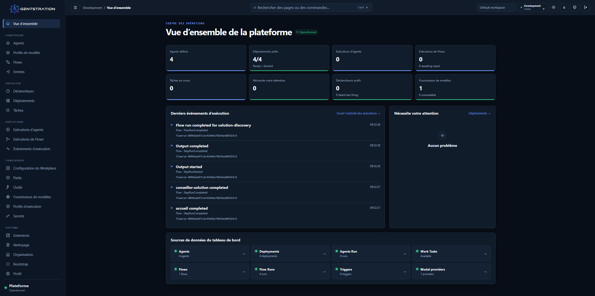

*La vue d’ensemble réunit l’état de la plateforme, l’activité récente et les accès
aux principales ressources opérationnelles.*

Ce point de départ commun aide les administrateurs à répondre d’abord aux
questions essentielles : l’environnement est-il prêt ? Un travail est-il en
cours ? Une erreur demande-t-elle une intervention ? Où poursuivre l’analyse ?

## Des fondations exécutables pour la plateforme

Agentstration rassemble dans un environnement gouverné les ressources nécessaires
à une solution à base d’agents. Les équipes peuvent définir des Agents, les relier
à des modèles et des runtimes, assembler des Flows, publier des points d’entrée,
planifier du travail et consulter les exécutions obtenues.

Les Packs hors ligne facilitent la distribution d’exemples ou de configurations
complètes. Un Pack installé indique clairement ce qu’il a ajouté au Workspace, les
liaisons qu’il utilise et les ressources qu’il gère. Son impact reste donc lisible
avant toute modification ou désinstallation.

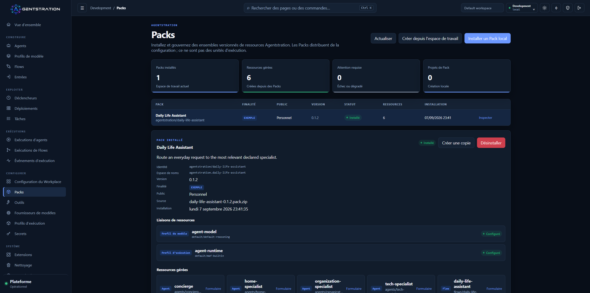

*Le Pack Assistant du quotidien expose les liaisons vers son modèle et son runtime,
ainsi que les ressources installées dans le Workspace.*

Les Secrets sont gérés séparément des ressources ordinaires. Les utilisateurs
peuvent vérifier qu’un identifiant est configuré, connaître son emplacement et son
Workspace, sans que sa valeur ne soit jamais affichée dans la Console.

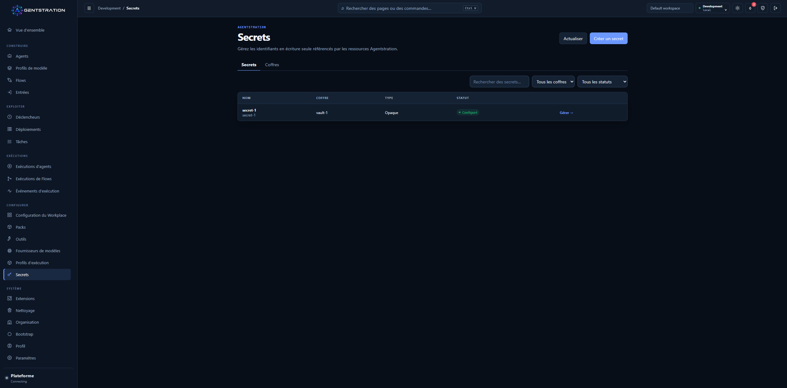

*Le catalogue des Secrets affiche les métadonnées gouvernées et l’état de la
configuration, jamais la valeur enregistrée.*

Ces capacités fournissent une base cohérente pour construire et exploiter des
solutions d’agents sans disperser leur configuration dans plusieurs outils.

> **Pour aller plus loin**
>
> - Le produit reste un monolithe modulaire local-first avec des frontières explicites
>   entre Management, Work, Runtime et Flow ; SQLite reste le stockage par défaut.
> - Les révisions et versions publiées des Flows sont immuables, tandis que
>   l’historique des Tâches et Déclencheurs reste durable.
> - La planification utilise `Quartz.NET` ; le Coffre local chiffre les valeurs en
>   AES-256-GCM.

## Des accès protégés pour les utilisateurs et les outils

Agentstration protège l’accès aux fonctions et aux données de chaque Workspace.
Les utilisateurs retrouvent les opérations autorisées par leur rôle, tandis que
les services nécessaires à la connexion, au premier démarrage et au suivi de
l’état de la plateforme restent disponibles.

Pour les scripts et les clients en ligne de commande, les utilisateurs peuvent
créer des jetons d’accès personnels limités à un Workspace. Le formulaire rend
explicites le nom, la durée de validité et les permissions. Le jeton n’est affiché
qu’une seule fois lors de sa création et peut ensuite être révoqué.

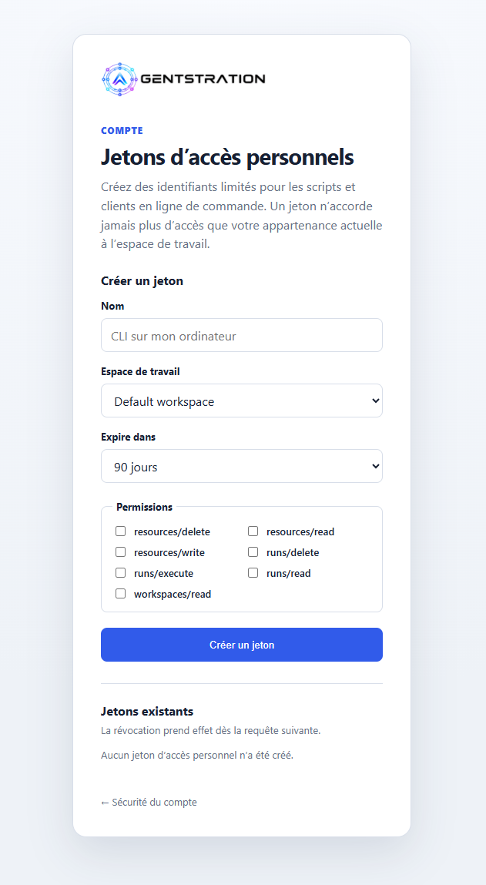

*Un jeton d’accès personnel limité au Workspace est préparé avec une expiration et
des permissions explicites.*

Les mêmes règles s’appliquent ainsi aux usages interactifs et automatisés. Lorsqu’un
rôle, une appartenance ou une permission évolue, les accès associés sont adaptés
sans qu’il soit nécessaire de recréer les intégrations.

> **Pour aller plus loin**
>
> - Seule l’empreinte SHA-256 d’un jeton d’accès personnel est stockée.
> - Les permissions effectives combinent la liste autorisée du jeton et le rôle actuel
>   du Principal dans le Workspace, réévalué à chaque requête.
> - Les chemins d’exécution, SSE, Workplace, entrée, annulation et audit appliquent
>   les périmètres Tenant, Workspace et Principal avant d’accéder aux données.

## Le Bootstrap devient un workflow d’environnement

Le Bootstrap fournit maintenant aux administrateurs un parcours guidé pour
reproduire un environnement. Ils peuvent sélectionner plusieurs profils, en
définir l’ordre, prévisualiser le résultat puis appliquer le plan seulement après
avoir vérifié ce qui sera créé.

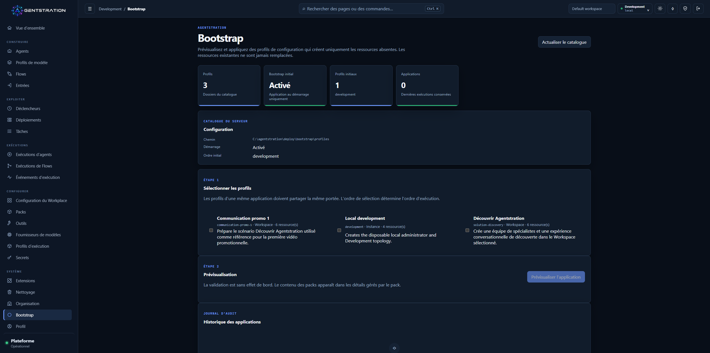

*Le catalogue Bootstrap réunit la sélection des profils, une prévisualisation sans
effet et l’historique des configurations appliquées.*

Un profil peut préparer un contexte de travail complet plutôt qu’une ressource
isolée : modèles, runtimes, Agents, Flows, Entrées et Packs locaux peuvent y
participer. Les ressources existantes sont préservées et l’historique indique
clairement ce qui a été appliqué et à quel moment.

Les mises à jour de Packs suivent la même approche contrôlée. Les ressources déjà
installées conservent leur identité, les modifications locales sont protégées et
les dépendances à nettoyer sont signalées au lieu d’être supprimées silencieusement.

> **Pour aller plus loin**
>
> - Les profils ciblent une Instance, un Tenant ou un Workspace et résolvent des
>   liaisons typées dans un ordre déclaré.
> - La prévisualisation est sans effet de bord, une empreinte protège le plan examiné
>   et les ressources existantes ne sont jamais écrasées.

## La configuration des ressources devient plus directe

La Console facilite l’inspection et la modification des définitions complètes des
Agents, Entrées et Flows. Les utilisateurs travaillent avec des formulaires
structurés tout en conservant l’accès à une vue Définition ou YAML ordonnée quand
ils ont besoin de la ressource entière. Les éléments installés par un Pack restent
protégés, tandis que les définitions locales ou dérivées restent modifiables.

Les Fournisseurs de modèles rendent visible la connexion entre Agentstration et un
service d’inférence. Depuis un même écran, un administrateur peut consulter
l’extension AEP choisie, l’état de la connexion, le point de terminaison effectif
et les modèles actuellement disponibles.

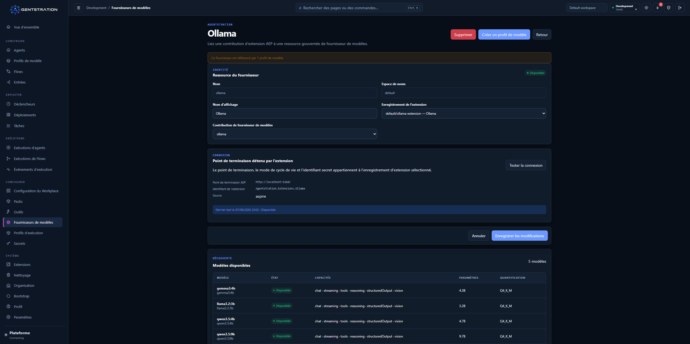

*Le fournisseur Ollama rassemble la ressource gouvernée, l’état de la connexion et
le catalogue découvert.*

Les Profils de modèle transforment ce choix de fournisseur et de modèle en une
configuration réutilisable. Plusieurs Agents peuvent partager le même profil sans
porter chacun les détails du service sous-jacent.

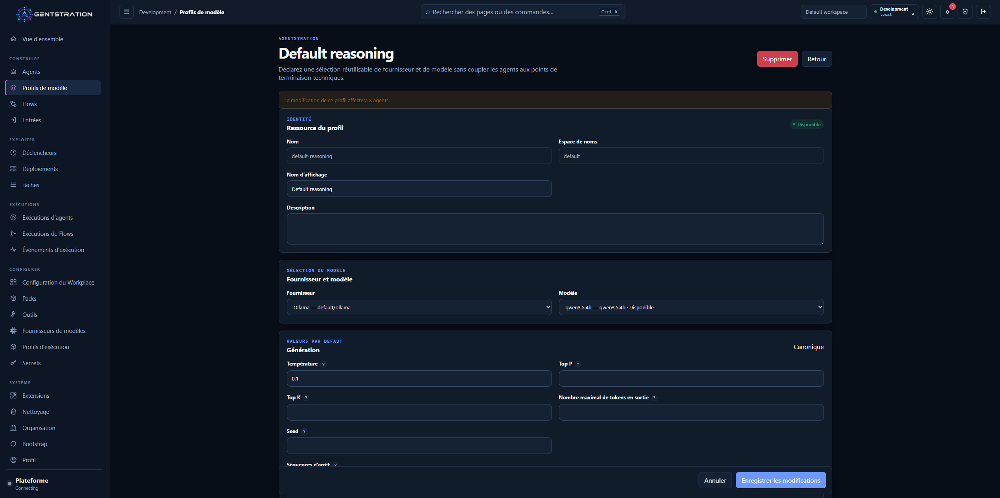

*Un Profil de modèle réutilisable associe le fournisseur Ollama gouverné à un
modèle Qwen découvert et à des paramètres de génération partagés.*

Les Profils d’exécution décrivent séparément la manière dont un Agent s’exécute.
Le profil intégré
[Microsoft Agent Framework](https://github.com/microsoft/agent-framework) présente
ses politiques de session, d’outils et de diffusion, ainsi que les Déploiements
concernés par une modification.

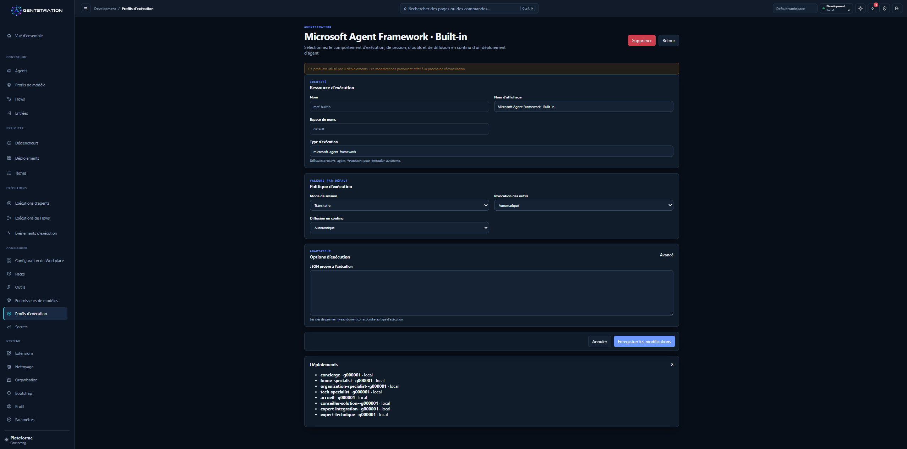

*Le profil d’exécution intégré rend le comportement du runtime et son utilisation
par les Déploiements consultables depuis la Console.*

> **Pour aller plus loin**
>
> - Un Fournisseur de modèles est une ressource gouvernée liée à une extension AEP.
> - Les Profils de modèle séparent les paramètres portables des options du fournisseur ;
>   les Profils d’exécution isolent l’adaptateur du choix du modèle.
> - Les instructions restent isolées par participant lors d’un Handoff. La capture
>   AEP sortante est réservée au Développement, explicite et désactivée par défaut.

## Création, exploitation et relecture des Flows fonctionnent ensemble

La création d’un Flow réunit désormais la conception visuelle et les choix
d’orchestration dans une expérience plus claire. Les auteurs peuvent organiser les
étapes, relier les transitions, modifier la définition, valider le brouillon et
l’exécuter sans quitter l’espace de travail du Flow.

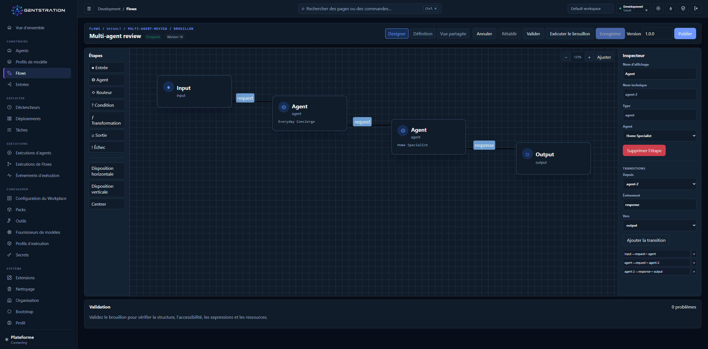

*Le Concepteur réunit la construction du graphe, l’édition des transitions,
l’exécution du brouillon et la validation dans une même surface.*

La collaboration multi-agent se configure indépendamment de la disposition
visuelle. Les auteurs peuvent choisir une exécution séquentielle, concurrente, par
transfert, par discussion de groupe ou magnétique, déclarer qui peut transmettre
le contrôle, limiter les tours et prévisualiser la topologie avant de créer
l’orchestration.

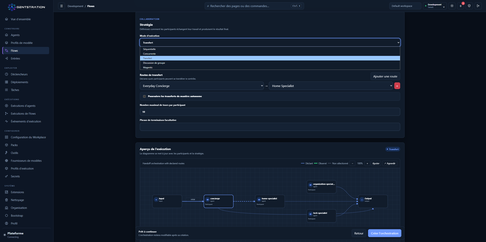

*La configuration Transfert rend visibles les routes autorisées, les limites et la
topologie attendue avant l’exécution.*

Les Déclencheurs planifiés relient une activité récurrente à un Flow gouverné. Leur
vue de détail indique la prochaine exécution attendue, le travail qui sera soumis,
l’identité utilisée et le résultat des occurrences précédentes.

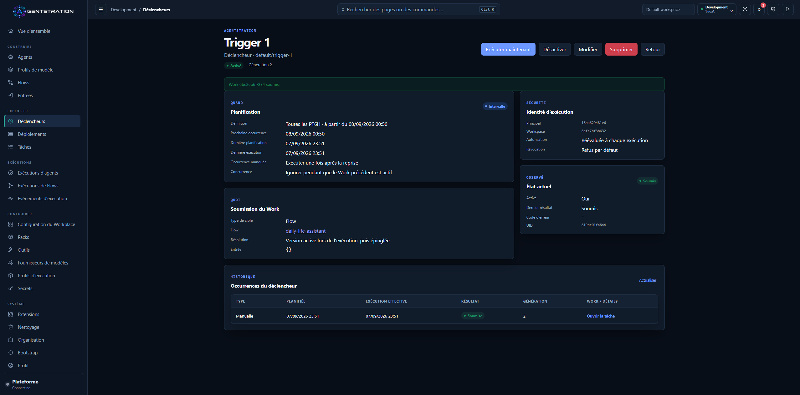

*Un Déclencheur rassemble son calendrier, sa cible, son état actuel et l’historique
de ses occurrences dans une vue auditable.*

Après l’exécution, la synthèse d’un Flow affiche la durée, les étapes terminées, les
tours, les participants, les transferts et le parcours observé. Des onglets dédiés
donnent accès à l’activité, aux transferts, aux entrées et sorties ainsi qu’aux
événements bruts lorsqu’une analyse plus poussée est nécessaire.

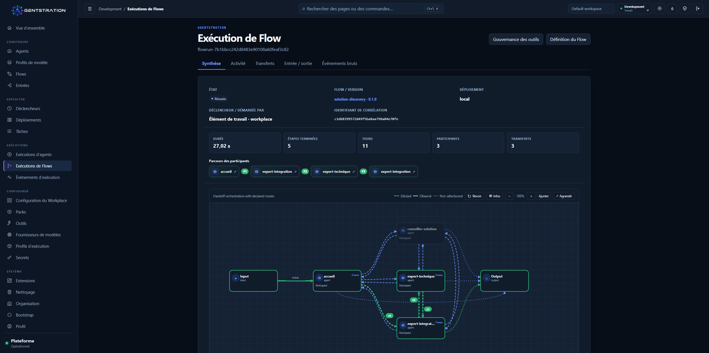

*Une exécution Handoff terminée présente à la fois l’orchestration déclarée et le
parcours réellement observé.*

Les exécutions terminées peuvent également être relues visuellement. Cette
relecture aide l’opérateur à comprendre la séquence passée sans relancer le Flow ni
appeler de nouveau ses outils.

> **Pour aller plus loin**
>
> - Les versions publiées des Flows sont immuables ; les exécutions conservent leurs
>   événements et instantanés de topologie.
> - La relecture reconstruit l’activité persistée sans réexécuter les Agents ni les
>   outils.
> - L’ordre stable des événements, le tracé des routes, la terminaison des Handoffs et
>   les contrôles de périmètre soutiennent l’expérience opérationnelle.

## Workplace devient une interface complète pour les utilisateurs

Workplace transforme les Entrées publiées en expériences ciblées pour les
utilisateurs. L’accueil sélectionne le dashboard attendu, emploie les noms usuels
de l’organisation, du Workspace et de l’utilisateur, et adapte proprement sa
navigation et ses cartes aux écrans plus petits.

Les administrateurs composent les dashboards depuis la Console. Ils choisissent
l’Entrée principale, déterminent les autres Entrées visibles, règlent leur rôle et
leur ordre, puis sélectionnent l’icône présentée aux utilisateurs de Workplace.

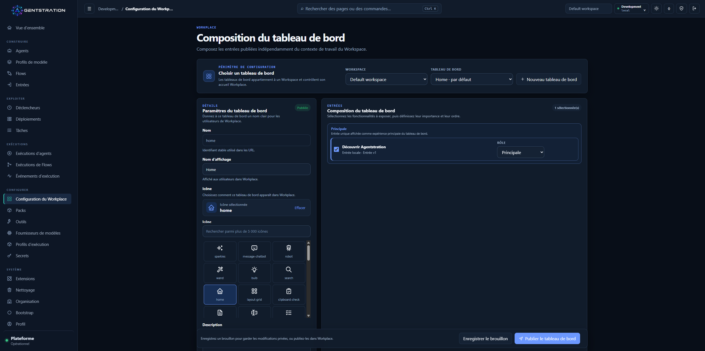

*Le dashboard Accueil publie Découvrir Agentstration comme expérience principale
et garde masquée l’Entrée fournie par le Pack.*

Sur mobile, l’expérience sélectionnée, les suggestions, les espaces disponibles,
le contexte du Principal et la navigation restent faciles d’accès.

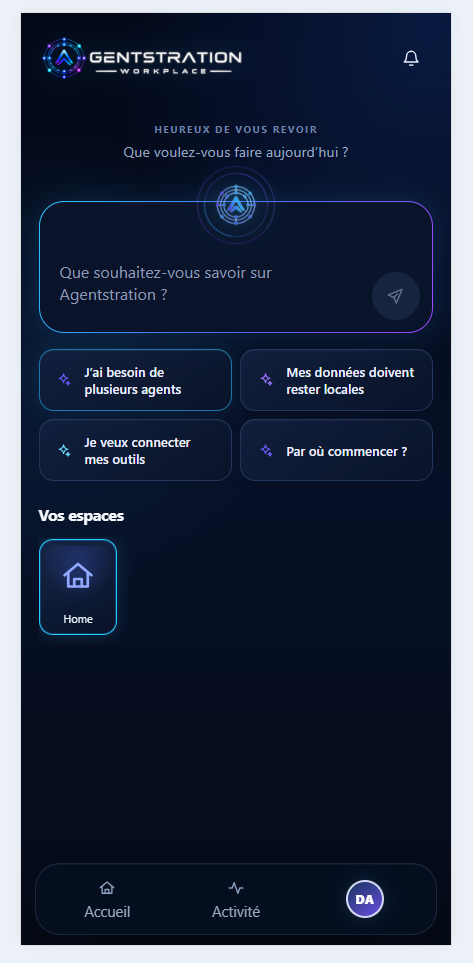

*L’accueil mobile conserve l’invite principale, quatre suggestions contrôlées, les
espaces et la navigation dans des dimensions adaptées au tactile.*

Les conversations donnent davantage de place à la demande et à la réponse tout en
gardant l’état de la Tâche et les détails d’exécution disponibles au besoin. Les
travaux longs et les changements de participant produisent moins de bruit visuel,
afin que l’utilisateur puisse se concentrer sur le résultat.

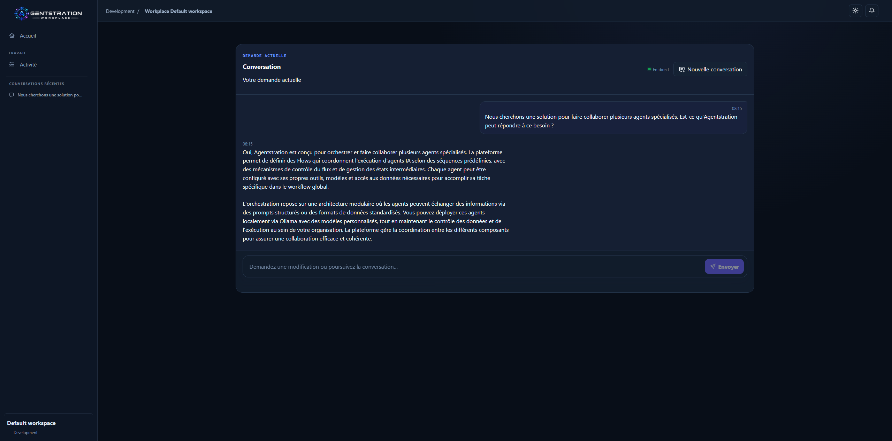

*La conversation Workplace présente le scénario contrôlé Découvrir Agentstration
avec sa Tâche terminée.*

La même interaction reste cohérente sur mobile : demande, réponse, état de la
Tâche, détails d’exécution, compositeur de poursuite et navigation inférieure
conservent le même ordre logique.

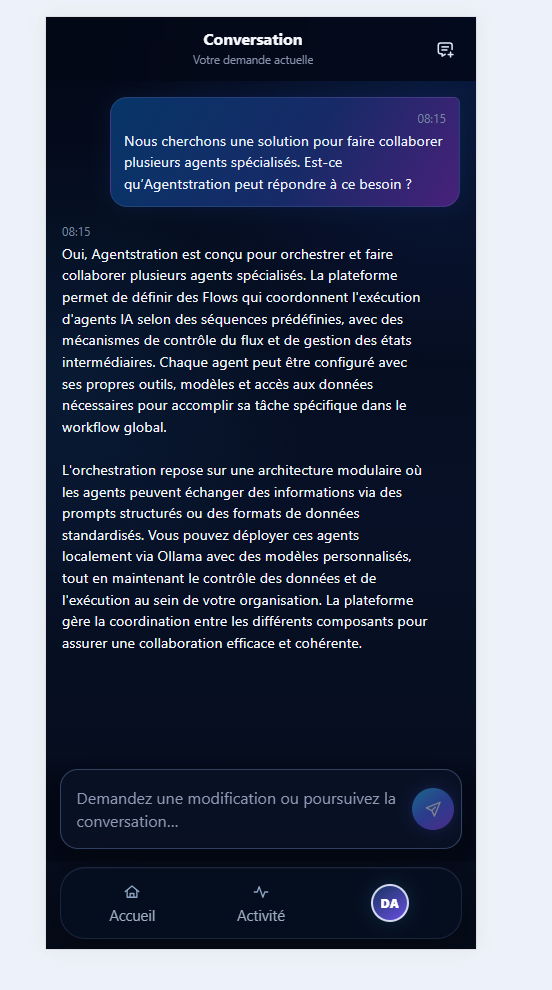

*La conversation mobile adapte la même expérience contrôlée que sur ordinateur.*

> **Pour aller plus loin**
>
> - La Console et Workplace fournissent des catalogues produit anglais et français et
>   enregistrent une préférence de langue par Principal.
> - Les identifiants techniques et le contenu utilisateur restent inchangés entre les
>   langues.
> - Le filtrage côté requête évite les recherches répétées tout en maintenant
>   l’isolation du Workspace.

## Le nettoyage devient guidé et explicite

La Console propose un écran de nettoyage du Workspace pour les données
d’exécutions terminées et les ressources de configuration. Les administrateurs
peuvent rechercher des éléments, les sélectionner en nombre, vérifier les
dépendances et confirmer l’opération irréversible avant toute suppression.

Le nettoyage respecte l’ordre imposé par les ressources. Les éléments supprimés
disparaissent de la sélection, tandis que les échecs restent disponibles pour une
nouvelle tentative accompagnée d’un résultat clair. Le nettoyage des environnements
d’évaluation locaux devient ainsi pratique sans masquer les dépendances ni les
échecs partiels.

> **Pour aller plus loin**
>
> - Les API canoniques de suppression s’exécutent dans l’ordre des dépendances et
>   exigent les permissions adaptées.
> - Seules les Tâches terminées, échouées ou annulées sont éligibles ; leurs données
>   Work sont supprimées et les conversations conservées sont détachées.
> - Une suppression réussie reste appliquée lorsqu’un élément ultérieur échoue.

## Davantage de choix de déploiement et des retours développeur plus clairs

Agentstration reste simple à évaluer localement avec SQLite comme stockage par
défaut. Les équipes qui exploitent déjà PostgreSQL peuvent choisir à la place un
profil PostgreSQL 17 pour les principales données persistées de la plateforme.

L’expérience de développement devient également plus claire. La documentation de
l’API est disponible avec OpenAPI et Swagger UI, le démarrage valide le stockage
sélectionné et Aspire peut isoler plusieurs environnements de Développement afin
que les contributeurs travaillent en parallèle sans partager leurs ports ni leur
état.

> **Pour aller plus loin**
>
> - PostgreSQL utilise des schémas et migrations séparés pour les modules, avec un
>   verrou consultatif pendant l’initialisation.
> - Les Secrets, clés, archives de Packs et artefacts Work sur fichiers nécessitent
>   une sauvegarde coordonnée. PostgreSQL n’ajoute pas le mode multi-instance.
> - En Développement, OpenAPI 3.1 décrit notamment l’authentification, les Problem
>   Details, les téléversements, les téléchargements et SSE.

## AEP maintient les extensions hors du processus de la plateforme

AEP — Agentstration Extension Protocol — permet à la plateforme de se connecter à
des capacités externes tout en gardant leur implémentation indépendante.
Agentstration conserve les ressources stables et leur gouvernance ; les extensions
restent responsables de la communication avec leurs propres services.

Pour l’inférence, un administrateur peut ainsi utiliser des services Ollama,
llama.cpp ou LocalAI existants sans intégrer leur code propre au fournisseur dans
le produit principal. Agentstration découvre les contributions de l’extension, les
expose à travers des Fournisseurs de modèles gouvernés et laisse le catalogue
externe sous le contrôle de son propriétaire.

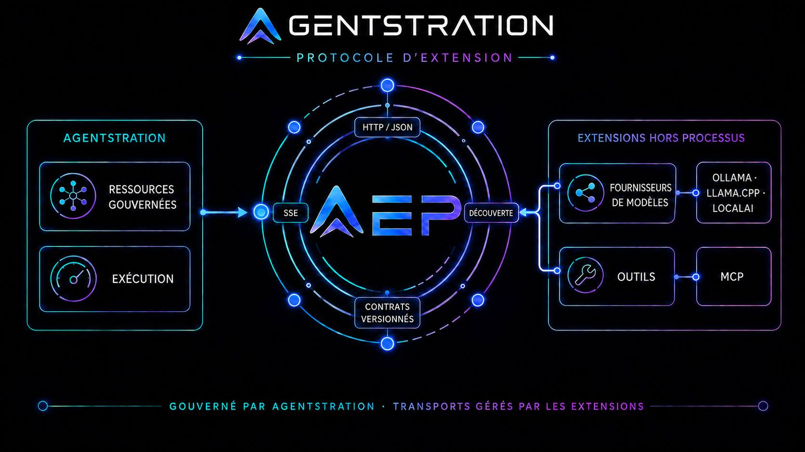

*AEP sépare la gouvernance assurée par Agentstration des transports appartenant aux
extensions indépendantes.*

La Console des Extensions rend cette frontière visible. Les administrateurs
peuvent consulter les points de terminaison enregistrés, l’état de la découverte,
les contributions disponibles, leurs versions et les ressources qui en dépendent.

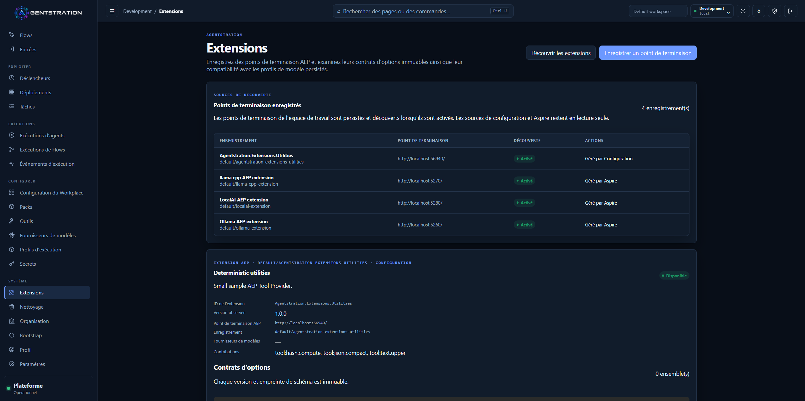

*La vue des Extensions réunit l’enregistrement, la découverte, les contributions et
leur utilisation persistée dans une même surface gouvernée.*

Les extensions d’outils suivent le même principe. AEP identifie le serveur MCP et
l’outil externes, tandis qu’Agentstration continue de contrôler l’approbation,
l’autorisation et l’audit. Tout nouvel outil découvert reste désactivé jusqu’à son
approbation par un administrateur.

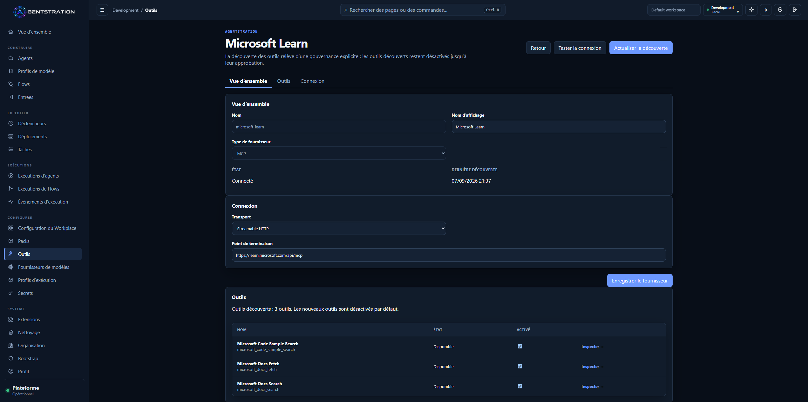

*Un fournisseur MCP connecté expose une découverte explicite et l’activation
individuelle de chaque outil.*

> **Pour aller plus loin**
>
> - AEP utilise la découverte HTTP/JSON et la diffusion des conversations par SSE.
> - Les Fournisseurs de modèles se lient à des contributions nommées, les Profils de
>   modèle peuvent épingler des contrats versionnés et le runtime consomme
>   `IChatClient`.
> - La découverte est explicite et ne scanne jamais le réseau local. MCP reste la
>   référence pour les outils, avec les garde-fous et l’audit durable d’Agentstration.

## Il faut prendre l’étiquette alpha au pied de la lettre

Cette préversion publique est destinée à l’évaluation et aux retours. Elle modifie
plusieurs fondations : sauvegardez les données d’évaluation importantes et démarrez
la version avec un stockage neuf. Le passage de SQLite à PostgreSQL ne transfère
pas non plus les données existantes.

La préversion GitHub fournit des archives ZIP du serveur et du Workplace autonome
pour Windows, Linux et macOS, ainsi que des images de conteneur AMD64 et ARM64.
Pour les sommes de contrôle, les commandes de démarrage, les détails de
compatibilité et la liste complète des limites connues, consultez les sources
publiées :

- [Version GitHub et artefacts](https://github.com/gbaudrit/agentstration/releases/tag/v0.2.0-alpha.1)
- [Notes techniques de la version à cette étiquette](https://github.com/gbaudrit/agentstration/blob/v0.2.0-alpha.1/docs/releases/0.2.0-alpha.1.md)
- [Capacités actuelles à cette étiquette](https://github.com/gbaudrit/agentstration/blob/v0.2.0-alpha.1/docs/reference/current-capabilities.md)
- [Référence du Bootstrap déclaratif](https://github.com/gbaudrit/agentstration/blob/v0.2.0-alpha.1/docs/reference/declarative-bootstrap.md)
- [Documentation](https://docs.agentstration.io)
- [Dépôt source](https://github.com/gbaudrit/agentstration)
- [Chaîne YouTube Agentstration](https://www.youtube.com/@Agentstration)
- [Site de la newsletter Agentstration](https://newsletter.agentstration.io/)
- [Site Agentstration](https://www.agentstration.io/fr/)

Si vous essayez cette alpha, les retours concrets sont particulièrement utiles :
quel environnement est difficile à reproduire, quelle frontière d’autorisation
reste peu claire et quels détails d’exécution manquent encore pour analyser une
orchestration ?

> **Pour aller plus loin**
>
> - Il n’existe pas de migration sur place prise en charge depuis une alpha antérieure ;
>   les anciens stockages peuvent contenir des données incompatibles.
> - Les exécutions de Flows et d’outils restent « au moins une fois ».
> - Les ZIP nécessitent le `Runtime ASP.NET Core` .NET 10. L’étiquette de conteneur de
>   la version est immuable, `alpha` reste un canal mobile et `latest` n’est pas publié.
