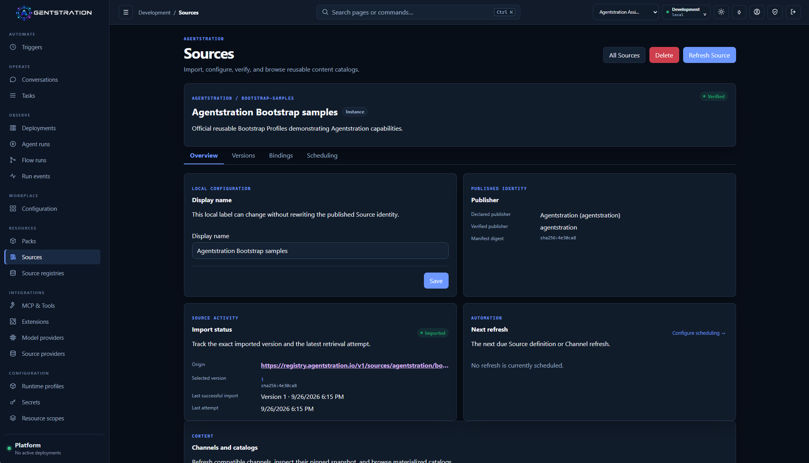
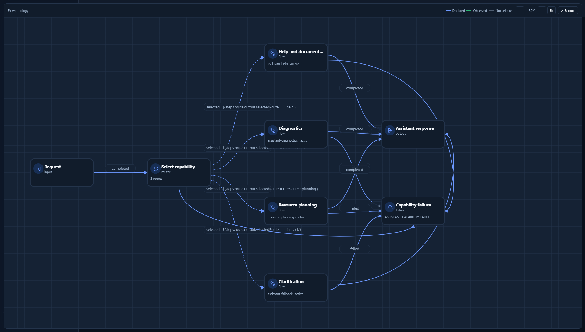
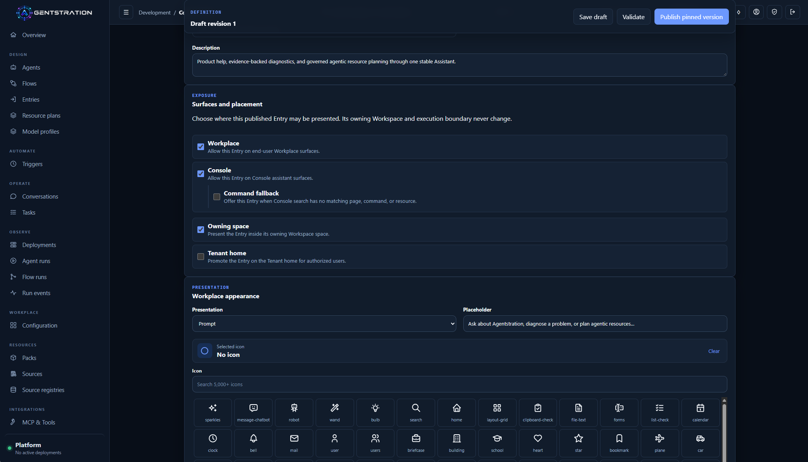
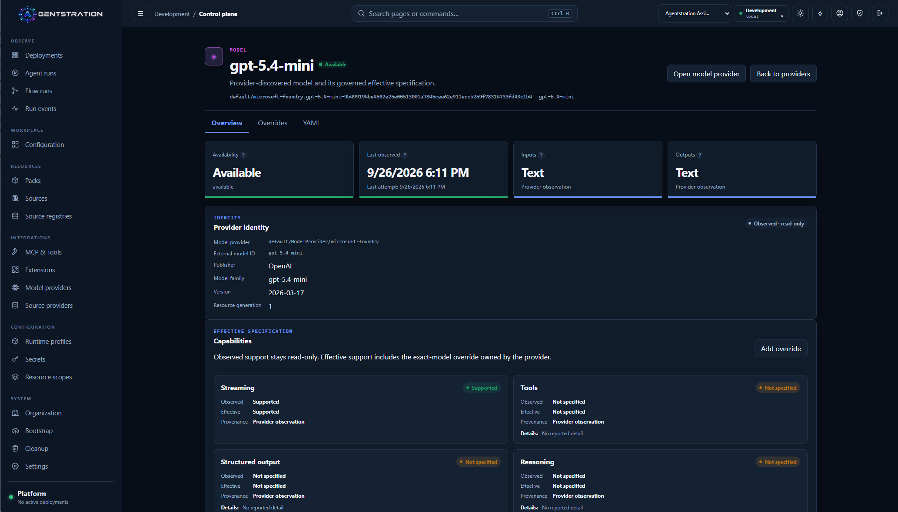
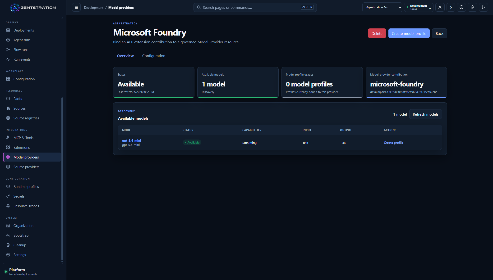

Agentstration has reached its third public alpha. The theme of this edition is not
simply “more resources” or “more screens.” It is the path between them: how a
capability is scoped, discovered, composed, executed, and observed without
dissolving the platform’s governance boundaries.

This remains an alpha for local evaluation and contributor feedback. The release
is not intended for production deployment, and a fresh data directory or empty
database is required when moving from the previous alpha.

## Watch the release

- [**Agentstration in 90 seconds**](https://www.youtube.com/watch?v=bRA8dmscYhs) — a
  concise introduction to the platform and its purpose.
- [**The three major new features**](https://www.youtube.com/watch?v=bB-G51DyjAo) —
  Microsoft Foundry, composed Flows, and governed capabilities exposed through the
  internal MCP server.

## In this edition

- [What this release enables today](#what-this-release-enables-today)
- [Every resource now has an explicit scope](#every-resource-now-has-an-explicit-scope)
- [Distributing official and community resources](#distributing-official-and-community-resources)
- [Flows become building blocks](#flows-become-building-blocks)
- [The Console becomes an interaction surface](#the-console-becomes-an-interaction-surface)
- [AEP becomes an authenticated boundary](#aep-becomes-an-authenticated-boundary)
- [What to keep in mind for this alpha](#what-to-keep-in-mind-for-this-alpha)

## What this release enables today

- Discover an exact Source version from an official, community, or private registry,
  inspect its evidence, and import it with retained provenance.
- Choose whether a resource belongs to the Instance, a Tenant, or a Workspace so its
  visibility and reuse remain intentional.
- Build a Flow that calls another published Flow and governed Tools while keeping a
  durable execution trail.
- Expose enabled Workspace Tool Definitions and selected internal Tools through an
  authenticated internal MCP endpoint.
- Start or resume Entry-backed conversations directly from the operations Console.
- Discover the models offered by a provider together with their declared capabilities
  before selecting them in a Model Profile.
- Connect existing Microsoft Foundry deployments as governed Model Providers through
  the optional AEP extension.
- Enroll out-of-process AEP extensions with dedicated credentials and connect an
  extension’s configuration requirements to Parameters and Secrets that are resolved
  only when used.

## Every resource now has an explicit scope

Management resources now state where they belong. An Instance-scoped resource
represents a capability shared by the platform. A Tenant-scoped resource can be
shared across an organization. A Workspace-scoped resource stays attached to the
working context that owns it.

This makes it possible to place configuration at the right level instead of
duplicating it or making it implicitly global. A Provider, Parameter, extension, or
another governed resource can be administered in its natural context, while every
operation continues to be evaluated with the current Tenant, Workspace, and
Principal permissions.

Hierarchical visibility does not mean that every parent resource is automatically
usable by its descendants. Vaults and Secrets default to denying descendant use: a
Tenant or Workspace must receive an explicit grant. The same separation prevents an
extension from choosing its own scope during enrollment; that decision belongs to an
administrator.

> **Under the hood**
>
> - Scope is part of resource identity and requests; it is not inferred from a name
>   or from the screen where the resource is used.
> - Resource-kind policies determine which scopes are valid and whether descendant
>   visibility is allowed.
> - Permissions are checked when the resource is actually used, not only when it is
>   created.

## Distributing official and community resources

Agentstration introduces a common mechanism for distributing resources published by
the official project, the community, or a private catalog. The goal is to let an
administrator discover a collection of resources, select the intended version, and
import it into the platform without relying on manually exchanged archives.

This first implementation uses Git. A Source describes the content to distribute,
while a Channel follows a branch or reference and resolves it to an immutable commit
when materialized. Packs in the resulting catalog can then be installed as ordinary
Agentstration resources.

The official registry provides the first discovery point. Community and private
registries can be added separately and remain under administrator control. Every
import retains its provenance, version, and evidence so that the origin of the
content remains visible after it enters the platform.

> **Under the hood**
>
> - Registry refresh is explicit or opt-in scheduled, retains a last-known-good
>   observation, and does not make startup depend on the network.
> - Trust is evaluated as separate evidence dimensions; a trusted registry does not
>   automatically verify a publisher, Source version, or mutable Channel snapshot.
> - The Source Registry .NET tool validates publications and computes canonical
>   digests without requiring a running Agentstration instance.

## Flows become building blocks

A complex orchestration should not require copying an existing graph. A Flow can now
call another published Flow and can invoke a governed Tool as ordinary steps. Authors
select an active or exact child version, map its input, and continue from its declared
output. The designer prevents dependency cycles before publication.

At runtime, the child receives its own durable Flow Run and remains linked to the
parent. Cancellation, bounded nesting, version resolution, and causal diagnostics
make the relationship visible instead of hiding it behind a model call. Governed
Tool steps use the same enablement, approval, audit, and provider pipeline as tools
assigned to Agents.

### Governed capabilities through internal MCP

This composition model also powers more than the visual designer. Agentstration now
exposes an authenticated internal MCP endpoint that publishes only enabled Workspace
Tool Definitions and a bounded set of internal Tools. A Flow can therefore become a
carefully scoped capability for an MCP client without exposing generic management
operations or an unrestricted Flow launcher.

> **Under the hood**
>
> - Entry, Trigger, REST, MCP, Agent, and Console submissions share one durable root
>   Flow boundary; nested calls use a distinct child-run boundary.
> - Flow and Tool execution remains at least once. The release does not claim
>   exactly-once external effects.
> - The internal MCP server exposes governed capabilities through `tools/list` and
>   `tools/call`, not general Management CRUD.

## The Console becomes an interaction surface

The Console is no longer limited to inspecting resources and execution. An Entry can
now be exposed specifically in the Console and invoked from there with the same
durable interaction model used by Workplace. Because every Entry targets a published
Flow, teams can create Flows dedicated to administration: guided diagnostics,
controlled operational procedures, or other internal capabilities that belong next
to the resources they help manage.

These administrative Flows do not bypass the platform. Invocation still selects the
Entry’s owning Workspace and follows the ordinary Work, Flow, authorization, Tool
governance, and audit boundaries. An authorized fallback Entry may also be proposed
when search finds no page, command, or resource, but the user must explicitly choose
it before any work starts.

The Conversations view lists principal-owned interactions and can resume them
without creating a parallel chat store. Operational users therefore get a direct
path from the Console to a governed administrative capability while its execution
record remains connected to the rest of the platform.

Provider discovery no longer retrieves only a list of model names. It also collects
their declared capabilities: modalities, support for streaming, Tools, structured
output or reasoning, and known limits when the provider supplies them. Every
discovered model becomes a governed resource that an administrator can inspect before
selecting it in a Model Profile.

Agentstration keeps provider observations, administrative overrides, and the
effective capabilities resolved by the platform distinct. Compatibility checks can
therefore use an explicit description of the model instead of relying on its
identifier alone.

Tool Categories also make the catalog easier to navigate, while Agents retain
explicit individual Tool references.

> **Under the hood**
>
> - Entry exposure selects Console and Workplace presentation independently;
>   invocation always executes in the Entry owner’s Workspace.
> - The Console now has an independently hostable BFF shell with opaque server-side
>   sessions and short-lived API delegations; the all-in-one server remains the
>   executable default.
> - The standalone BFF uses an in-memory session store by default. Multiple replicas
>   require a shared session-store implementation, and external OIDC login is not yet
>   implemented.
> - Model overrides may fill unknown information or tighten limits, but cannot turn
>   an explicitly unsupported capability into a supported one.

## AEP becomes an authenticated boundary

Agentstration Extension Protocol extensions are deliberately out of process. This
release makes that separation an authenticated lifecycle rather than a configured
URL alone. An extension can announce itself through a pairing code or SharedKeyFile;
an administrator assigns its Instance, Tenant, or Workspace scope. Dedicated
credentials can be rotated or revoked, and the unified Extensions experience shows
enrollment, registration, availability, connection, and contributions together.

An extension can now declare the values required by each of its contributions. An
administrator then binds those requirements to governed Parameters or Secrets at the
appropriate scope. One extension process can therefore serve several independently
configured Providers without turning their endpoints, authentication modes, or
credentials into global process configuration.

Bindings are resolved late, when discovery, connection testing, or inference is
performed. A Parameter edit, Secret rotation, or permission change therefore affects
the next operation without copying the value into the Provider resource. When an
extension needs a Secret, it receives a short-lived, one-use grant restricted to the
exact context; the value does not appear in the resource, an ordinary response, or a
trace.

The optional Microsoft Foundry extension is the clearest example of this boundary.
It connects existing Foundry project deployments as Model Providers, supports model
discovery, text chat, streaming, and governed Tool calls, and leaves Agentstration
authoritative for Agents, profiles, revisions, and Tool governance. Azure remains
optional: the deterministic SQLite path still runs without a cloud account or remote
provider.

## What to keep in mind for this alpha

There is no supported in-place migration from the previous alpha. Back up anything
that matters, then use a fresh data directory or empty database. A published build
does not create a default credential: use `/bootstrap` on the authoritative server
or an explicit declarative Bootstrap profile.

Agentstration remains a single-process modular monolith. Source refresh needs network
access when invoked, the independently hosted Console needs additional session-store
work before multiple replicas, and Pack dependency resolution, signatures, and
transactional cross-store reconciliation are not implemented. Foundry requires an
existing project and deployment; Agentstration creates neither cloud resources nor
models.

The release provides server and standalone Workplace ZIPs, multi-architecture server
containers, and the Source Registry tool. For startup commands, checksums, breaking
changes, and the complete boundary list, use the published sources:

- [GitHub Release and artifacts](https://github.com/gbaudrit/agentstration/releases/tag/v0.3.0-alpha.1)
- [Technical release notes at the published tag](https://github.com/gbaudrit/agentstration/blob/v0.3.0-alpha.1/docs/releases/0.3.0-alpha.1.md)
- [Source Registry reference](https://github.com/gbaudrit/agentstration/blob/v0.3.0-alpha.1/docs/reference/source-registries.md)
- [Microsoft Foundry integration](https://github.com/gbaudrit/agentstration/blob/v0.3.0-alpha.1/docs/foundry-integration.md)
- [Documentation](https://docs.agentstration.io/)
- [Source repository](https://github.com/gbaudrit/agentstration)
- [Agentstration website](https://agentstration.io/)
- [Agentstration YouTube channel](https://www.youtube.com/@Agentstration)
- [Agentstration newsletter archive](https://newsletter.agentstration.io/)

If you evaluate this alpha, feedback is especially useful around the evidence needed
before importing a Source, the clarity of extension enrollment, and the execution
details required to understand a composed Flow.
