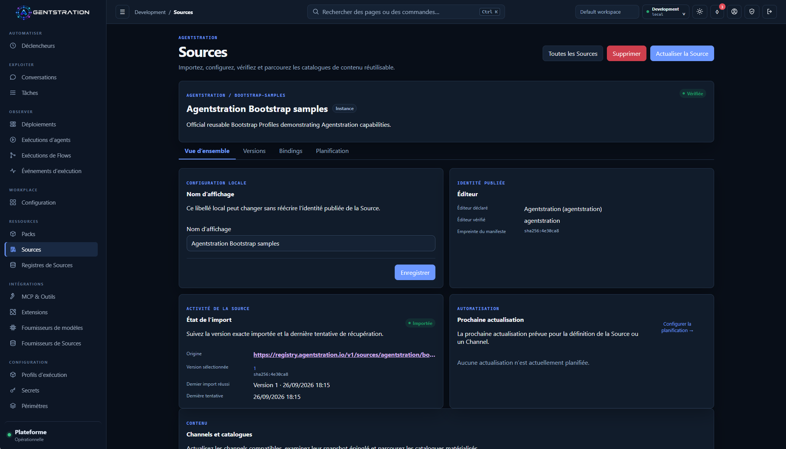
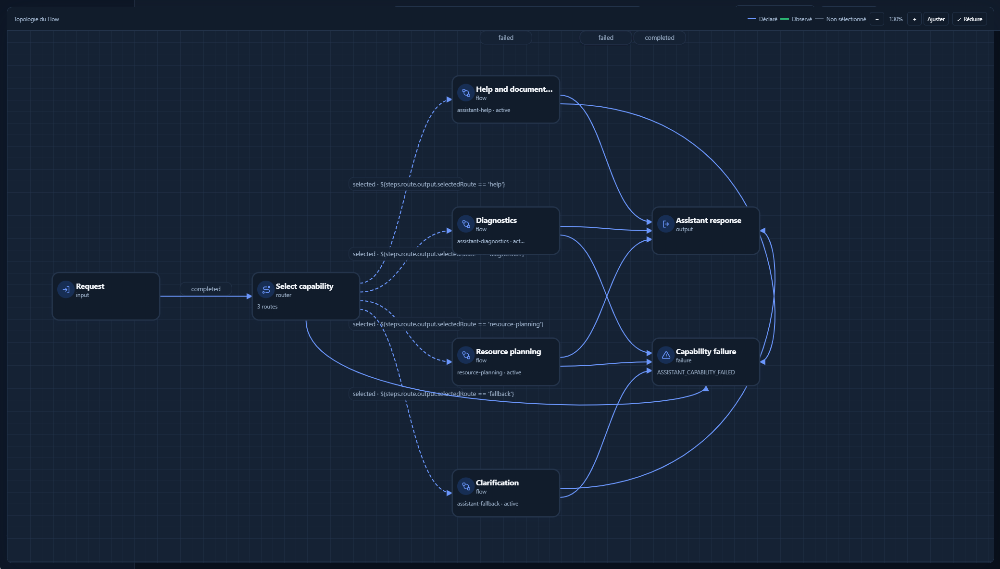
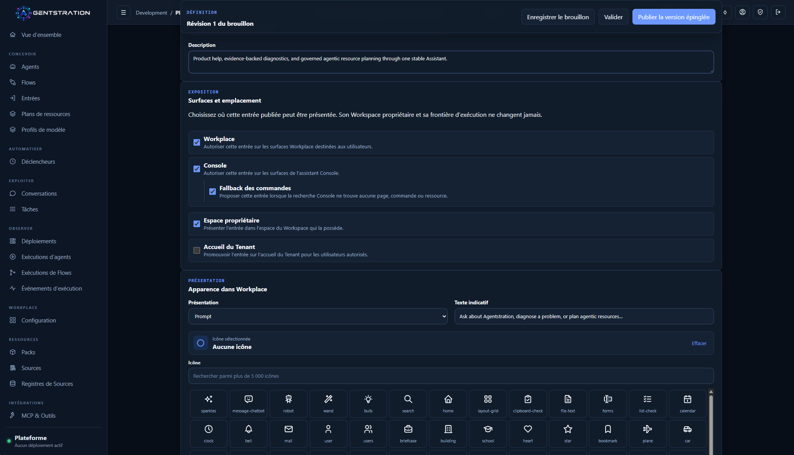
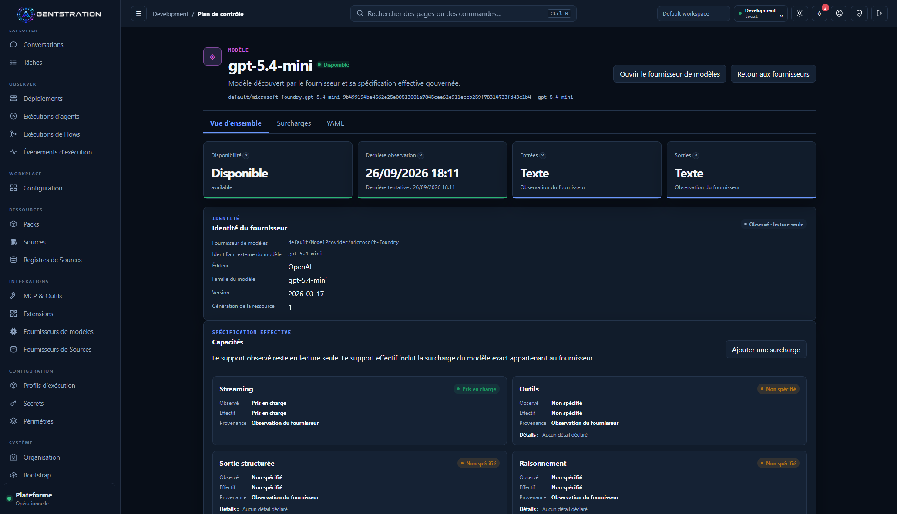
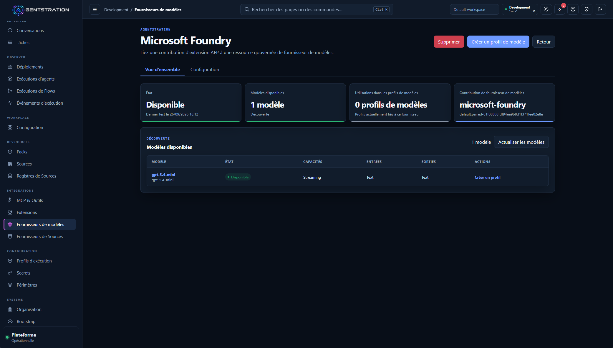

Agentstration atteint sa troisième alpha publique. Le fil conducteur de cette édition
n’est pas simplement l’ajout de ressources ou d’écrans. Il s’agit du parcours qui les
relie : définir la portée d’une capacité, la découvrir, la composer, l’exécuter et
l’observer sans diluer les règles de gouvernance de la plateforme.

Cette version reste une alpha destinée à l’évaluation locale et aux retours des
contributeurs. Elle n’est pas destinée à la production et nécessite un répertoire de
données neuf ou une base vide lors du passage depuis l’alpha précédente.

## Voir la version en vidéo

- [**Agentstration en 90 secondes**](https://www.youtube.com/watch?v=bRA8dmscYhs) —
  une présentation concise de la plateforme et de sa vocation.
- [**Les 3 nouveautés majeures**](https://www.youtube.com/watch?v=bB-G51DyjAo) —
  Microsoft Foundry, les Flows composés et l’exposition de capacités gouvernées via
  le serveur MCP interne.

## Dans cette édition

- [Ce que cette version permet aujourd’hui](#ce-que-cette-version-permet-aujourdhui)
- [Chaque ressource possède maintenant une portée explicite](#chaque-ressource-possède-maintenant-une-portée-explicite)
- [Distribuer des ressources officielles et communautaires](#distribuer-des-ressources-officielles-et-communautaires)
- [Les Flows deviennent des briques de composition](#les-flows-deviennent-des-briques-de-composition)
- [La Console devient une surface d’interaction](#la-console-devient-une-surface-dinteraction)
- [AEP devient une frontière authentifiée](#aep-devient-une-frontière-authentifiée)
- [Ce qu’il faut garder à l’esprit pour cette alpha](#ce-quil-faut-garder-à-lesprit-pour-cette-alpha)

## Ce que cette version permet aujourd’hui

- Découvrir une version précise d’une Source depuis un registre officiel,
  communautaire ou privé, examiner ses preuves et l’importer avec sa provenance.
- Choisir si une ressource appartient à l’Instance, à un Tenant ou à un Workspace,
  afin d’en maîtriser la visibilité et la réutilisation.
- Construire un Flow qui appelle un autre Flow publié et des Outils gouvernés tout en
  conservant une trace d’exécution durable.
- Exposer les Définitions d’Outils actives du Workspace et certains Outils internes
  via un point MCP interne authentifié.
- Démarrer ou reprendre des conversations adossées à une Entrée directement dans la
  Console d’exploitation.
- Découvrir les modèles proposés par un Fournisseur ainsi que leurs capacités
  déclarées avant de les utiliser dans un Profil de modèle.
- Relier des déploiements Microsoft Foundry existants comme Fournisseurs de modèles
  gouvernés grâce à l’extension AEP optionnelle.
- Enrôler des extensions AEP hors processus avec leurs propres identifiants et relier
  leurs besoins de configuration à des Paramètres et des Secrets résolus au moment
  de leur utilisation.

## Chaque ressource possède maintenant une portée explicite

Les ressources de gestion indiquent désormais explicitement leur niveau de
rattachement. Une ressource d’Instance représente une capacité commune à la
plateforme. Une ressource de Tenant peut être partagée à l’échelle d’une organisation.
Une ressource de Workspace reste attachée à l’espace de travail qui la possède.

Ce choix permet de placer une configuration au bon niveau au lieu de la dupliquer ou
de la rendre implicitement globale. Un Fournisseur, un Paramètre, une extension ou
une autre ressource gouvernée peut ainsi être administré dans son contexte naturel,
tandis que les opérations continuent d’être évaluées avec le Tenant, le Workspace et
les droits du Principal courant.

La visibilité hiérarchique ne signifie pas que toute ressource parente est
automatiquement utilisable par ses descendants. Les Vaults et les Secrets appliquent
un refus par défaut : leur utilisation depuis un Tenant ou un Workspace descendant
doit être accordée explicitement. La même séparation empêche une extension de choisir
elle-même sa portée lors de son enrôlement ; cette décision appartient à
l’administrateur.

> **Pour aller plus loin**
>
> - La portée fait partie de l’identité et des requêtes de la ressource ; elle n’est
>   pas déduite de son nom ou de l’écran depuis lequel elle est utilisée.
> - Les politiques propres à chaque type de ressource déterminent les portées
>   autorisées et la visibilité descendante.
> - Les droits restent vérifiés lors de l’utilisation effective de la ressource, pas
>   uniquement lors de sa création.

## Distribuer des ressources officielles et communautaires

Agentstration introduit un mécanisme commun pour distribuer des ressources issues du
projet officiel, de la communauté ou d’un catalogue privé. L’objectif est de permettre
à un administrateur de découvrir un ensemble de ressources, de choisir précisément
la version attendue puis de l’importer dans la plateforme sans dépendre d’un échange
manuel d’archives.

Cette première implémentation s’appuie sur Git. Une Source décrit le contenu à
distribuer, tandis qu’un Canal suit une branche ou une référence puis la résout vers
un commit immuable au moment de sa matérialisation. Les Packs présents dans le
catalogue peuvent ensuite être installés comme des ressources Agentstration
ordinaires.

Le registre officiel fournit le premier point de découverte. Des registres
communautaires ou privés peuvent être ajoutés séparément et restent sous le contrôle
de l’administrateur. Chaque import conserve sa provenance, sa version et ses preuves,
afin que l’origine du contenu reste visible après son arrivée dans la plateforme.

> **Pour aller plus loin**
>
> - L’actualisation d’un registre est manuelle ou planifiée sur activation, conserve
>   la dernière observation valide et ne rend pas le démarrage dépendant du réseau.
> - La confiance repose sur plusieurs dimensions indépendantes : un registre approuvé
>   ne vérifie pas automatiquement un éditeur, une version de Source ou l’instantané
>   d’un Canal mutable.
> - L’outil .NET Source Registry valide les publications et calcule leurs empreintes
>   canoniques sans nécessiter une instance Agentstration en cours d’exécution.

## Les Flows deviennent des briques de composition

Une orchestration complexe ne devrait pas imposer de recopier un graphe existant. Un
Flow peut désormais appeler un autre Flow publié et invoquer un Outil gouverné comme
des étapes ordinaires. L’auteur choisit une version active ou précise du Flow enfant,
mappe ses entrées et poursuit à partir de sa sortie déclarée. Le concepteur bloque les
cycles de dépendances avant la publication.

À l’exécution, le Flow enfant possède sa propre exécution durable tout en restant lié
au parent. L’annulation, la profondeur maximale, la résolution des versions et les
diagnostics de causalité rendent cette relation visible au lieu de la masquer derrière
un appel de modèle. Les étapes d’Outils suivent les mêmes règles d’activation,
d’approbation, d’audit et de fournisseur que les Outils assignés aux Agents.

### Des capacités gouvernées via le MCP interne

Ce modèle de composition dépasse le concepteur visuel. Agentstration expose maintenant
un point MCP interne authentifié qui publie uniquement les Définitions d’Outils actives
du Workspace et un ensemble borné d’Outils internes. Un Flow peut ainsi devenir une
capacité précisément délimitée pour un client MCP, sans exposer les opérations de
gestion génériques ni un lanceur de Flows sans restriction.

> **Pour aller plus loin**
>
> - Les soumissions depuis une Entrée, un Déclencheur, REST, MCP, un Agent ou la
>   Console partagent une même frontière racine durable ; les appels imbriqués passent
>   par une frontière distincte pour les exécutions enfants.
> - L’exécution des Flows et des Outils reste « au moins une fois ». La version ne
>   revendique pas d’effets externes « exactement une fois ».
> - Le serveur MCP interne expose des capacités gouvernées avec `tools/list` et
>   `tools/call`, pas les opérations CRUD générales du plan de gestion.

## La Console devient une surface d’interaction

La Console ne se limite plus à l’inspection des ressources et des exécutions. Une
Entrée peut désormais être exposée spécifiquement dans la Console et appelée depuis
celle-ci avec le même modèle d’interaction durable que Workplace. Comme chaque Entrée
cible un Flow publié, les équipes peuvent créer des Flows dédiés à l’administration :
diagnostic guidé, procédure opérationnelle contrôlée ou autre capacité interne placée
à côté des ressources qu’elle aide à gérer.

Ces Flows d’administration ne contournent pas la plateforme. L’appel sélectionne
toujours le Workspace propriétaire de l’Entrée et respecte les frontières habituelles
de Work, de Flow, d’autorisation, de gouvernance des Outils et d’audit. Une Entrée de
repli autorisée peut également être proposée lorsque la recherche ne trouve ni page,
ni commande, ni ressource, mais l’utilisateur doit la sélectionner explicitement
avant le démarrage de tout travail.

La vue Conversations liste les interactions du Principal et permet de les reprendre
sans créer de stockage de chat parallèle. Les utilisateurs opérationnels disposent
ainsi d’un accès direct depuis la Console vers une capacité d’administration
gouvernée, dont l’exécution reste reliée au reste de la plateforme.

La découverte d’un Fournisseur ne récupère plus uniquement une liste de noms de
modèles. Elle recueille aussi leurs capacités déclarées : modalités, prise en charge
du streaming, des Outils, de la sortie structurée ou du raisonnement, ainsi que les
limites connues lorsqu’elles sont fournies. Chaque modèle découvert devient une
ressource gouvernée que l’administrateur peut consulter avant de l’associer à un
Profil de modèle.

Agentstration distingue les informations observées auprès du Fournisseur, les
éventuelles surcharges administratives et les capacités effectives retenues par la
plateforme. Les contrôles de compatibilité peuvent ainsi s’appuyer sur une description
explicite du modèle plutôt que sur son seul identifiant.

Les Catégories d’Outils rendent également le catalogue plus lisible, tandis que les
Agents conservent des références individuelles explicites vers leurs Outils.

> **Pour aller plus loin**
>
> - La politique d’exposition d’une Entrée distingue indépendamment sa présentation
>   dans la Console et dans Workplace ; son appel s’exécute toujours dans son
>   Workspace propriétaire.
> - La Console dispose maintenant d’un shell BFF hébergeable séparément, avec des
>   sessions opaques côté serveur et des délégations API de courte durée ; le serveur
>   tout-en-un reste l’exécutable par défaut.
> - Le BFF autonome utilise un stockage de sessions en mémoire par défaut. Plusieurs
>   réplicas nécessitent un stockage partagé, et la connexion OIDC externe n’est pas
>   encore implémentée.
> - Une surcharge de modèle peut compléter une information inconnue ou réduire une
>   limite, mais ne peut pas transformer une capacité explicitement non prise en
>   charge en capacité disponible.

## AEP devient une frontière authentifiée

Les extensions Agentstration Extension Protocol s’exécutent volontairement hors du
processus principal. Cette version transforme cette séparation en cycle de vie
authentifié plutôt qu’en simple URL configurée. Une extension peut s’annoncer avec
un code d’association ou un SharedKeyFile ; un administrateur lui attribue ensuite
une portée Instance, Tenant ou Workspace. Ses identifiants dédiés peuvent être
renouvelés ou révoqués, et l’expérience Extensions rassemble l’enrôlement,
l’enregistrement, la disponibilité, la connexion et les contributions.

Une extension peut maintenant déclarer les valeurs dont chacune de ses contributions
a besoin. L’administrateur relie ensuite ces exigences à des Paramètres ou des Secrets
gouvernés, avec la portée adaptée. Une même extension peut ainsi servir plusieurs
Fournisseurs configurés indépendamment, sans transformer leurs points de terminaison,
leurs modes d’authentification ou leurs identifiants en configuration globale du
processus.

Ces liaisons sont résolues tardivement, au moment de la découverte, du test de
connexion ou de l’inférence. Une modification de Paramètre, une rotation de Secret
ou un changement de droit est donc pris en compte lors de l’opération suivante, sans
copier la valeur dans la ressource Fournisseur. Lorsqu’une extension a besoin d’un
Secret, elle reçoit une autorisation de courte durée, à usage unique et limitée au
contexte exact ; la valeur n’apparaît ni dans la ressource, ni dans une réponse ou
une trace ordinaire.

L’extension Microsoft Foundry optionnelle illustre clairement cette frontière. Elle
relie des déploiements de projet Foundry existants sous forme de Fournisseurs de
modèles, prend en charge la découverte, le chat texte, le streaming et les appels
d’Outils gouvernés, tandis qu’Agentstration reste l’autorité pour les Agents, les
profils, les révisions et la gouvernance des Outils. Azure reste optionnel : le
parcours déterministe avec SQLite fonctionne toujours sans compte cloud ni
fournisseur distant.

## Ce qu’il faut garder à l’esprit pour cette alpha

Il n’existe pas de migration sur place prise en charge depuis l’alpha précédente.
Sauvegardez ce qui doit l’être, puis utilisez un répertoire de données neuf ou une
base vide. Une application publiée ne crée aucun identifiant par défaut : utilisez
`/bootstrap` sur le serveur faisant autorité ou un profil Bootstrap déclaratif
explicite.

Agentstration reste un monolithe modulaire à processus unique. L’actualisation des
Sources nécessite le réseau lorsqu’elle est déclenchée, la Console hébergée séparément
demande un stockage de sessions supplémentaire avant d’être répliquée, et la
résolution des dépendances de Packs, les signatures ainsi que la réconciliation
transactionnelle entre stockages ne sont pas implémentées. Foundry nécessite un
projet et un déploiement existants ; Agentstration ne crée ni ressource cloud ni
modèle.

La version fournit des archives ZIP pour le serveur et Workplace autonome, des
conteneurs serveur multiarchitecture et l’outil Source Registry. Pour les commandes
de démarrage, les sommes de contrôle, les ruptures de compatibilité et la liste
complète des limites, consultez les sources publiées :

- [Version GitHub et artefacts](https://github.com/gbaudrit/agentstration/releases/tag/v0.3.0-alpha.1)
- [Notes techniques à l’étiquette publiée](https://github.com/gbaudrit/agentstration/blob/v0.3.0-alpha.1/docs/releases/0.3.0-alpha.1.md)
- [Référence des registres de Sources](https://github.com/gbaudrit/agentstration/blob/v0.3.0-alpha.1/docs/reference/source-registries.md)
- [Intégration Microsoft Foundry](https://github.com/gbaudrit/agentstration/blob/v0.3.0-alpha.1/docs/foundry-integration.md)
- [Documentation](https://docs.agentstration.io/)
- [Dépôt source](https://github.com/gbaudrit/agentstration)
- [Site Agentstration](https://agentstration.io/)
- [Chaîne YouTube Agentstration](https://www.youtube.com/@Agentstration)
- [Archives de la newsletter Agentstration](https://newsletter.agentstration.io/)

Si vous évaluez cette alpha, les retours sont particulièrement utiles sur les preuves
nécessaires avant d’importer une Source, la clarté de l’enrôlement des extensions et
les détails d’exécution nécessaires pour comprendre un Flow composé.
